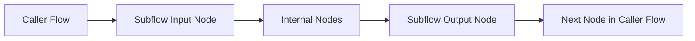
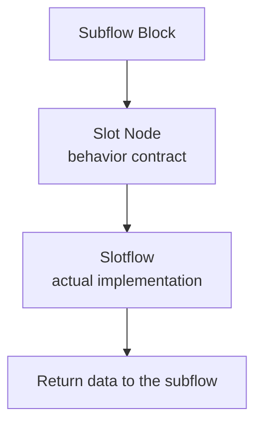
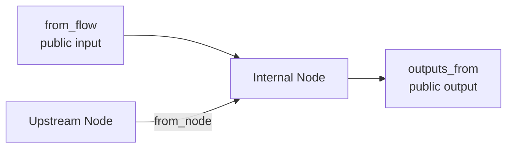
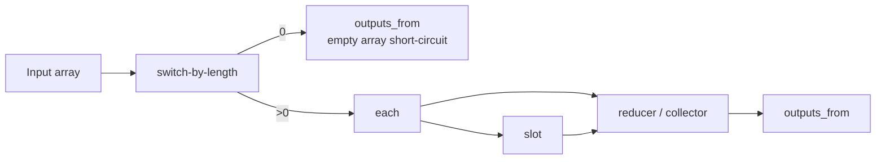

import Image from "@theme/ThemedImage";
import useBaseUrl from "@docusaurus/useBaseUrl";

#  Subflow Block Advanced Usage

After creating a subflow Block, we can click on the subflow Block in the left shared Block panel to enter the subflow Block's editing page.

We can see that there are Block mode and workflow mode at the bottom of the editing page.

<Image
  sources={{
    light: useBaseUrl(
      "/img/docs/advanced-guide/advanced-block-usage/subflow-block-view.png"
    ),
    dark: useBaseUrl(
      "/img/docs/advanced-guide/advanced-block-usage/subflow-block-view.png"
    ),
  }}
  width="720"
/>

The configuration in Block mode is basically consistent with the configuration in [Universal Block Settings](/docs/advanced-guide/universal-block-settings). Here we mainly introduce the usage in workflow mode.

## Position in the Reuse Model

Subflow Blocks sit between ordinary Flows and task Blocks:

| Concept | Best used for | File form |
| --- | --- | --- |
| Flow | Final runnable logic, experiments, tests, and debugging | `flow.oo.yaml` |
| Task Block | One stable operation | `task.oo.yaml` |
| Subflow Block | Reusable multi-step logic | `subflow.oo.yaml` |
| Slotflow | The implementation of one slot inside a subflow usage | `slotflow.oo.yaml` |

A common pattern is:

1. Build and verify logic in a normal Flow.
2. Extract the repeated multi-step section into a subflow Block.
3. Keep changeable behavior as slots so different callers can provide different implementations.

## Input and Output Nodes

After entering workflow mode, you can see two special Nodes added to the subflow interface:

<Image
  sources={{
    light: useBaseUrl(
      "/img/docs/advanced-guide/advanced-block-usage/subflow-flow-view.png"
    ),
    dark: useBaseUrl(
      "/img/docs/advanced-guide/advanced-block-usage/subflow-flow-view.png"
    ),
  }}
  width="720"
/>

These two Nodes actually correspond to the input and output Handles in Block mode. If your subflow is not connected to the input and output Handles, the subflow cannot receive input from the outside and produce output.

The usage of input and output Nodes is basically consistent with the input and output Handles in Block mode, except that there is an additional quick Handle creation operation:

<Image
  sources={{
    light: useBaseUrl(
      "/img/docs/advanced-guide/advanced-block-usage/subflow-block-quick-create-handle.gif"
    ),
    dark: useBaseUrl(
      "/img/docs/advanced-guide/advanced-block-usage/subflow-block-quick-create-handle.gif"
    ),
  }}
  width="720"
/>

The quickly created Handle will copy the name and type of the connected Handle.

The Handles created on the input and output Nodes will also be reflected in the input and output Handles in Block mode, and vice versa.

Input and output Nodes cannot be deleted. If users don't need input or output, they can choose not to connect wires.

In authoring terms, these Nodes are the public boundary of the subflow. Everything connected between them is internal implementation detail. Everything exposed on them becomes part of the subflow's contract to the outside world.



## Slots

Slots are shared Blocks dedicated to subflow Blocks, which only appear in the right system Block panel when in the workflow editing mode of subflow Blocks.

<Image
  sources={{
    light: useBaseUrl(
      "/img/docs/advanced-guide/advanced-block-usage/subflow-block-slot-position.png"
    ),
    dark: useBaseUrl(
      "/img/docs/advanced-guide/advanced-block-usage/subflow-block-slot-position.png"
    ),
  }}
  width="720"
/>

### The Significance of Slots

Considering that subflow Block developers need the functionality of certain Blocks but don't care about how the Blocks are implemented (or need users to implement them themselves), in this case, users of the subflow can implement their own functional Blocks and integrate them into the subflow, allowing the entire workflow to run normally. This gives users the freedom to implement part of the functionality.

> For example: A subflow Block developer needs to analyze data through AI, so the developer defines a slot where the input is data content and the output is a string of analysis results. Then users can implement different AI analysis Blocks based on their own AI keys, using their own API tokens.

Or subflow Blocks extract parts that may frequently change and modify as slots, which can be arbitrarily replaced at the point of use, reducing modifications to key code Blocks.

> For example: A developer relies on a third-party library that updates very frequently. They can define a slot where the input is the input passed to the third-party library and the output is the output of the third-party library, then publish the subflow. This way, the third-party library can be integrated into the subflow externally, and when the third-party library updates, only the external Block needs to be updated, while the subflow doesn't need to be updated.

The slot itself is a Block, but only input and output Handles can be configured.

### Usage

Slots are used similarly to regular shared Blocks and can be dragged into the workflow for wiring:

<Image
  sources={{
    light: useBaseUrl(
      "/img/docs/advanced-guide/advanced-block-usage/subflow-block-slot-use.png"
    ),
    dark: useBaseUrl(
      "/img/docs/advanced-guide/advanced-block-usage/subflow-block-slot-use.png"
    ),
  }}
  width="720"
/>

The difference is that you can directly modify the Handle names and parameters on the slot Block.

After adding and connecting slots, returning to Block mode shows that the subflow Block has an additional slot panel:

<Image
  sources={{
    light: useBaseUrl(
      "/img/docs/advanced-guide/advanced-block-usage/subflow-block-slot-ui.png"
    ),
    dark: useBaseUrl(
      "/img/docs/advanced-guide/advanced-block-usage/subflow-block-slot-ui.png"
    ),
  }}
  width="720"
/>

This slot panel here only has display functionality.

When the subflow Block is used in a workflow, you can click the slot's settings button to enter the slot's editing interface:

<Image
  sources={{
    light: useBaseUrl(
      "/img/docs/advanced-guide/advanced-block-usage/subflow-block-slot-inflow.png"
    ),
    dark: useBaseUrl(
      "/img/docs/advanced-guide/advanced-block-usage/subflow-block-slot-inflow.png"
    ),
  }}
  width="720"
/>

The slot editing interface is basically consistent with the subflow editing interface, or rather, slots are a type of subflow:

<Image
  sources={{
    light: useBaseUrl(
      "/img/docs/advanced-guide/advanced-block-usage/subflow-block-slot-edit.png"
    ),
    dark: useBaseUrl(
      "/img/docs/advanced-guide/advanced-block-usage/subflow-block-slot-edit.png"
    ),
  }}
  width="720"
/>

Slots also have input and output Nodes, and you can insert one or more Nodes within the slot. This is consistent with the subflow editing method.

After editing is complete, return to the workflow interface to run the subflow Block:

<Image
  sources={{
    light: useBaseUrl(
      "/img/docs/advanced-guide/advanced-block-usage/subflow-block-run.png"
    ),
    dark: useBaseUrl(
      "/img/docs/advanced-guide/advanced-block-usage/subflow-block-run.png"
    ),
  }}
  width="720"
/>

The execution of subflow Blocks is the same as regular Blocks, with the only difference being that slot content must be edited, otherwise the running conditions cannot be met.

## Slotflow

When a subflow containing slots is used in a caller Flow, each slot is implemented by a small workflow. This workflow is often called a `slotflow`.

You can think of the relationship like this:



- The slot defines what inputs it will send out and what outputs it expects back.
- The slotflow provides the concrete implementation for that contract.
- Different caller Flows can provide different slotflows for the same subflow.

This is what makes subflows reusable without hard-coding every internal decision.

## Forwarding Previews

Subflows may contain many internal Nodes, and several of them may emit previews. In most reusable subflows, callers do not need to see every internal preview. Instead, subflows can selectively forward the previews that matter most to the outside.

```yaml
forward_previews:
  - files-downloader#1
```

This is especially useful when a subflow wraps a larger internal graph but you still want the caller Flow to see one or two meaningful user-facing previews.

Good practice:

- Forward only the 1-2 previews that are most useful to end users.
- Prefer previews that explain progress or expose the most important artifact.
- Avoid forwarding every internal preview, otherwise the subflow stops feeling encapsulated.

For the preview API itself, see [Node.js SDK API](/docs/workflow-engine/nodejs-sdk-api#contextpreview-types) or [Python SDK API](/docs/workflow-engine/python-sdk-api#contextpreview-types).

## Data Routing Model

If you edit subflows through YAML or want to reason precisely about how data moves, the following terms are the key ones:

| Field | Meaning |
| --- | --- |
| `inputs_def` | Public inputs accepted by a task, subflow, or slot |
| `outputs_def` | Public outputs declared by a task, subflow, or slot |
| `inputs_from` | Where a Node receives each input from |
| `outputs_from` | How a subflow or slotflow exposes internal results outward |
| `from_flow` | Read data from the outer boundary of the current subflow or slotflow |
| `from_node` | Read data from another internal Node |

In UI terms, this is just wiring. In authoring terms, it is the contract that determines what can enter and leave the reusable unit.



Two rules are especially important:

1. A public output of a subflow must be routed from an internal result.
2. Slot output names and slotflow output names must match exactly, otherwise the subflow cannot receive the expected result.

If a public output is routed from multiple internal sources, the first valid completed source becomes the outward-facing result. This is useful for short-circuit branches such as empty-array handling.

## Reference Forms in YAML

If you edit reusable units through YAML, the most common local reference forms are:

| Use case | Form |
| --- | --- |
| Reference a local task | `task: self::{name}` |
| Reference a local subflow | `subflow: self::{name}` |
| Reference a local slotflow | `slotflow: self::+slotflow#N` |

When a reusable unit comes from another package, use that package namespace instead of `self::`.

## Authoring Rules

The UI hides much of the file structure, but the underlying model still follows a few stable rules:

- Root-level `outputs_from` is required for a subflow to expose outputs to its caller.
- A slot Node still needs upstream input wiring. Defining slot Handles alone is not enough.
- Extra parameters passed into a slot need both a declared Handle and actual wiring in the caller Flow.
- Slotflow outputs should match the slot contract exactly.
- If a subflow can finish through multiple valid branches, its public output can route from multiple internal sources.
- Optional Handles can be modeled with `nullable`, and when a default is intentionally empty, leaving the value empty is often clearer than inventing a placeholder value.

This is commonly used for short-circuit cases such as empty arrays.

## Canonical Array Pattern

The built-in `Map` and `Filter` style subflows are good examples of the standard array-processing pattern:



This pattern exists for a reason:

- `self::switch-by-length` cleanly separates empty and non-empty arrays.
- `self::each` emits item-by-item iteration data.
- `switch-by-length` handles the empty-array branch early.
- `each` emits one item at a time together with metadata such as index and length.
- `slot` leaves the per-item behavior replaceable.
- `reducer` or collector Nodes accumulate the final result.

If you are designing reusable multi-item processing, this pattern is usually easier to maintain than putting all logic into one large script Node.

For a field-by-field reference of YAML forms such as `inputs_def`, `outputs_from`, and `self::` references, see [Flow YAML Authoring](/docs/advanced-guide/flow-yaml-authoring).
