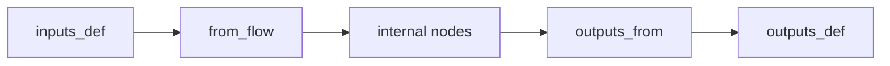
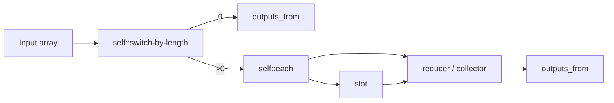

# Flow YAML Authoring

Most users can build Flows entirely through the OOMOL Studio UI. This page is for cases where you want to understand or edit the underlying YAML model directly.

## Where Reusable Units Live

The most common authoring units are stored in these directories:

| Unit | Directory | Main file |
| --- | --- | --- |
| Flow | `flows/{name}/` | `flow.oo.yaml` |
| Task Block | `tasks/{name}/` | `task.oo.yaml` |
| Subflow Block | `subflows/{name}/` | `subflow.oo.yaml` |
| Slotflow | `slotflows/+slotflow#N/` | `slotflow.oo.yaml` |

In practice:

- A Flow is the runnable entry point.
- A task Block is a reusable single operation.
- A subflow Block is a reusable multi-step workflow.
- A slotflow is a small workflow used to implement a slot contract.

## Reference Forms

The most common local reference forms are:

| What you want to reference | YAML form |
| --- | --- |
| Local task | `task: self::{name}` |
| Local subflow | `subflow: self::{name}` |
| Local slotflow | `slotflow: self::+slotflow#N` |

When the target comes from another package, replace `self::` with that package namespace.

## Public Contract vs Internal Wiring

OOMOL YAML separates two concerns:

| Concern | Typical fields | Meaning |
| --- | --- | --- |
| Public contract | `inputs_def`, `outputs_def` | What the reusable unit publicly accepts and returns |
| Internal wiring | `inputs_from`, `outputs_from`, `from_flow`, `from_node` | How data actually moves between boundaries and internal Nodes |



## Core Fields

### `inputs_def`

Defines the input Handles that a task, subflow, or slot accepts.

```yaml
inputs_def:
  - handle: array
    json_schema:
      type: array
```

### `outputs_def`

Defines the output Handles that the reusable unit promises to return.

```yaml
outputs_def:
  - handle: result
    json_schema:
      type: string
```

### `inputs_from`

Defines where an individual Node gets each input from.

```yaml
inputs_from:
  - handle: text
    from_node:
      - node_id: reader#1
        output_handle: text
```

The source can be one of these:

- `from_node`: read from another Node inside the current Flow or subflow
- `from_flow`: read from the public boundary of the current subflow or slotflow
- `value`: use an inline value

### `outputs_from`

Defines how a subflow or slotflow exposes internal results to the outside.

```yaml
outputs_from:
  - handle: result
    from_node:
      - node_id: formatter#1
        output_handle: text
```

Without root-level `outputs_from`, a subflow may complete internally but still expose no usable public output.

## Common Wiring Patterns

### Task Node in a Flow

```yaml
nodes:
  - node_id: summarize#1
    task: self::summarize
    inputs_from:
      - handle: text
        from_node:
          - node_id: reader#1
            output_handle: text
```

### Subflow Node in a Flow

```yaml
nodes:
  - node_id: filter#1
    subflow: self::filter
    inputs_from:
      - handle: array
        from_node:
          - node_id: +value#1
            output_handle: array
```

### Slotflow Bound to a Subflow Slot

```yaml
nodes:
  - node_id: filter#1
    subflow: self::filter
    slots:
      - slot_node_id: +slot#1
        slotflow: self::+slotflow#1
```

## Slot Contracts

A slot defines a behavior boundary inside a subflow:

```yaml
- node_id: +slot#1
  node_type: slot_node
  slot:
    inputs_def:
      - handle: item
        json_schema: {}
    outputs_def:
      - handle: predicate
        json_schema:
          type: boolean
```

Important rules:

- The slot still needs `inputs_from` wiring to receive upstream data.
- The slotflow must return outputs using the exact same public Handle names expected by the slot.
- Extra slot parameters usually need both declaration and wiring in the caller Flow.

## Nullable and Defaults

Optional Handles can be described with `nullable`.

```yaml
inputs_def:
  - handle: output_dir
    json_schema:
      type: string
    nullable: true
```

When the intended default is genuinely empty, an empty `value:` is often better than inventing a placeholder value that later needs special handling.

## Multi-Source Outputs

Some subflows can finish through more than one valid branch. In that case, one public output can route from multiple internal sources:

```yaml
outputs_from:
  - handle: array
    from_node:
      - node_id: reducer#1
        output_handle: array
      - node_id: switch-by-length#1
        output_handle: "0"
```

This pattern is commonly used for short-circuit branches such as empty-array handling.

## Array-Oriented Subflow Pattern

Reusable array-processing subflows often follow this shape:



This pattern helps keep empty-array handling, per-item behavior, and final aggregation separate.

## Validation Checklist

Before assuming the runtime is wrong, check these authoring rules first:

1. Handle names must match exactly.
2. Required inputs must be wired, unless they are intentionally nullable.
3. Local reusable-unit references should use the correct namespace form such as `self::`.
4. Subflows should expose public results through root-level `outputs_from`.
5. Slot outputs and slotflow outputs should use the same Handle names.
6. Ordinary Flows should not contain direct circular dependencies.

For the UI-side explanation of subflows and slots, see [Subflow Block Advanced Usage](/docs/advanced-guide/advanced-subflow-block).
