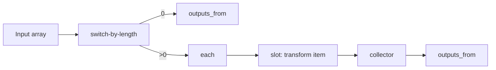
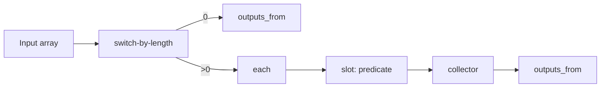
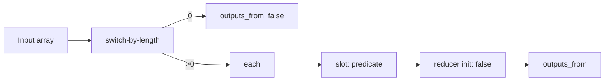
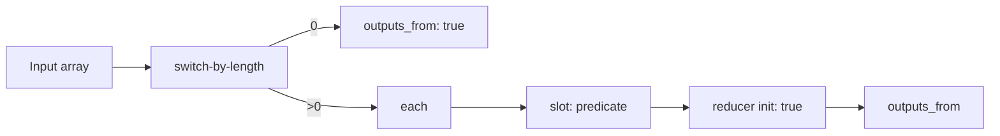
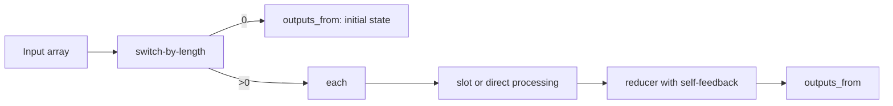
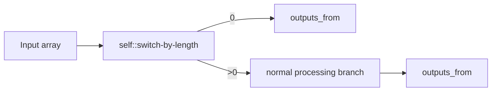
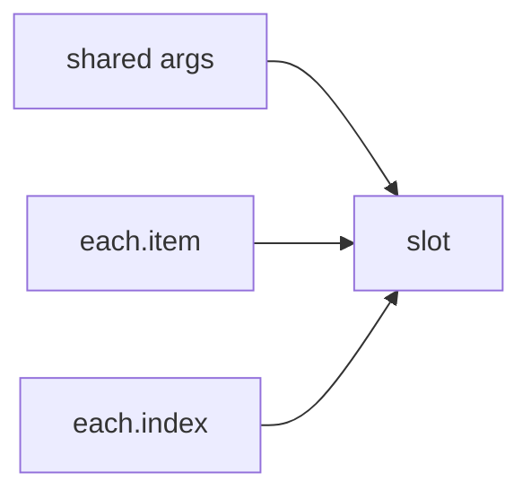

# Subflow Recipes

This page collects common reusable subflow patterns. It is meant as a design cookbook: when you know the behavior you want, find the closest pattern and adapt it.

For YAML field definitions such as `inputs_from` and `outputs_from`, see [Flow YAML Authoring](/docs/advanced-guide/flow-yaml-authoring).

## Choosing a Pattern

| Goal | Typical pattern |
| --- | --- |
| Transform each item into another item | `map` |
| Keep only items that satisfy a condition | `filter` |
| Return whether any item satisfies a condition | `some` |
| Return whether all items satisfy a condition | `every` |
| Accumulate items into one result | `reduce` / collector |
| Split empty and non-empty branches early | `switch-by-length` + multi-source `outputs_from` |

## Map

Use `map` when each input item should produce one output item.

Good fit:

- Renaming files
- Formatting strings
- Converting objects into another schema

Key rule:

- The slot should return the transformed item, not a boolean predicate.

## Filter

Use `filter` when each item produces a yes/no decision.

Good fit:

- Keeping only valid records
- Removing blocked domains
- Selecting images that pass a test

Key rule:

- The slot should return a boolean-like decision for each item.

## Some

Use `some` when the result should be one boolean saying whether at least one item matches.

Good fit:

- Detect whether any file is oversized
- Detect whether any message contains a keyword
- Detect whether any step failed a check

Key rule:

- The reducer initial value is usually `false`.

## Every

Use `every` when the result should be one boolean saying whether all items match.

Good fit:

- Confirming every required file exists
- Confirming every output is valid
- Confirming every item passed moderation

Key rule:

- The reducer initial value is usually `true`.

## Reduce / Collector

Use `reduce` when many items should accumulate into one structured result.

Good fit:

- Building a summary object
- Counting categories
- Grouping items by key
- Producing a report from many records

Key rules:

- Use a dedicated reducer init Node.
- Feed the reducer output back into the reducer input.
- Choose an initial value that matches the final output type.

## Empty-Array Short-Circuit

Many reusable array subflows should handle empty arrays explicitly.

Why this helps:

- It makes the empty case predictable.
- It avoids unnecessary work.
- It keeps reducers and slots from receiving invalid assumptions about array length.

## Passing Extra Parameters into Slots

Sometimes the per-item behavior needs shared arguments, such as a prefix, threshold, or API setting.

Good fit:

- Prefix text for `map`
- Threshold value for `filter`
- Category rules for `reduce`

Key rules:

- Declare the extra slot inputs.
- Wire the extra slot inputs from the caller Flow.
- Keep the slot contract stable when possible.

## Recipe Selection Heuristics

Use these shortcuts when deciding quickly:

- If the output length should equal the input length, start from `map`.
- If the output length may shrink, start from `filter`.
- If the output is a single boolean, start from `some` or `every`.
- If the output is one object, array, or summary value, start from `reduce`.

## Common Failure Modes

| Symptom | Likely recipe issue |
| --- | --- |
| Empty arrays fail unexpectedly | No short-circuit branch |
| Slot output never arrives | Slot and slotflow contracts do not match |
| Final type is inconsistent | Reducer initial value does not match the intended result type |
| Logic is hard to update | Too much behavior is hard-coded instead of delegated through a slot |

For the conceptual explanation of slots and slotflows, see [Subflow Block Advanced Usage](/docs/advanced-guide/advanced-subflow-block).
