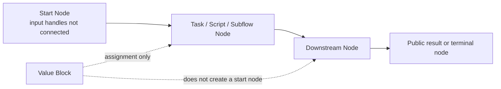

import Image from "@theme/ThemedImage";
import useBaseUrl from "@docusaurus/useBaseUrl";

# Flow

A Flow is a specific implementation of a business purpose.

After creating a project, you can start implementing your business purpose.

## Related Concepts

Flow is the runtime container that organizes different reusable units. In practice, users usually work with the following four concepts together:

| Concept | Typical location | What it represents | Can be reused by other Flows |
| --- | --- | --- | --- |
| Flow | `flows/` | A runnable workflow used as an entry point, test case, or final application logic | No, a Flow itself is not inserted directly into another Flow |
| Task Block | `tasks/` | A reusable single-operation Block | Yes |
| Subflow Block | `subflows/` | A reusable multi-step workflow wrapped as one Block | Yes |
| Slotflow | Created inside a Flow when configuring a slot | A small workflow that implements the contract of a slot in a subflow | It serves the slot it belongs to |

If you want to package a complete multi-step capability and use it elsewhere, convert it into a [Subflow Block](/docs/advanced-guide/advanced-subflow-block). If you only need one atomic operation, a task Block is usually enough.

## Creation

After you create a project, OOMOL Studio will create a default Flow for you. You can also create a new Flow through the create button in the left Flow panel.

<Image
  sources={{
    light: useBaseUrl("/img/docs/concepts/create-flow.png"),
    dark: useBaseUrl("/img/docs/concepts/create-flow.png"),
  }}
  width="720"
/>

After selecting a Flow, you can see that the central panel enters the Flow editing window.

## Editing

A Flow itself is composed of one or more [Nodes](/docs/concepts/node). You can find various [Blocks](/docs/concepts/block) from the right Block panel, and after adding them to the Flow, they become Nodes of the Flow.

A Flow must have at least one Node to be meaningful. Here we add two Nodes to the Flow: one for creating an email client and one for sending emails. Then we connect the Nodes:

<Image
  sources={{
    light: useBaseUrl("/img/docs/concepts/new-flow.png"),
    dark: useBaseUrl("/img/docs/concepts/new-flow.png"),
  }}
  width="720"
/>

This way, the Flow implements an email sending business, which is divided into two steps: first create an email client, then use the client to send emails.

Each Node in a Flow is responsible for one part of the business logic. Some Nodes are direct task executions, some are subflow invocations, and some are helper Nodes such as the [Value Block](/docs/advanced-guide/reusable-constants).

## Execution Model

The scheduler in OOMOL Studio is data-flow driven. In other words, a Node runs when the data required by its input Handles is ready, not because it appears later on the canvas.

## Execution

In OOMOL Studio, only Flows are executable concepts. We can run the entire Flow or run Nodes within the Flow:

<Image
  sources={{
    light: useBaseUrl("/img/docs/concepts/run-flow.png"),
    dark: useBaseUrl("/img/docs/concepts/run-flow.png"),
  }}
  width="720"
/>

The execution order of a Flow follows the connections between Nodes. Before execution, OOMOL Studio performs a search to find Nodes with **unconnected input Handles** as the starting Nodes for execution. If there are multiple starting Nodes, all these starting Nodes will start running simultaneously.

Then Nodes are executed in the order of output Handle -> input Handle connections until completion.

This model leads to a few important consequences:

1. Canvas position does not define execution order. Wiring does.
2. Multiple start Nodes can run in parallel if they do not depend on each other.
3. A selected Node can be run together with its required upstream Nodes, which makes debugging local sections of a Flow easier.
4. Subflow Nodes behave like ordinary Nodes in the caller Flow. Their internal details stay encapsulated unless you open the subflow itself for editing.

:::info
There is a special case of wiring here. The wiring of the [Value Block](/docs/advanced-guide/reusable-constants) is only considered as assignment and will not affect the result of judging whether the Node is the start Node.
:::

## Flow Boundaries

A Flow is also the boundary for several kinds of configuration:

- Runtime records and logs are collected per Flow run. See [Run & Debug](/docs/get-started/run-and-debug).
- Shared Blocks can be inserted multiple times in the same Flow, and each inserted instance becomes a separate [Node](/docs/concepts/node).
- A Flow can be turned into a reusable subflow Block when the internal multi-step logic should be reused in other Flows.
