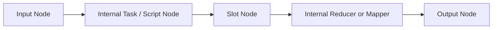

import Image from "@theme/ThemedImage";
import useBaseUrl from "@docusaurus/useBaseUrl";

# Node

A Node is a Block that composes a Flow. It is the name for a Block in a specific usage environment.

When you place one or more Blocks in the Flow editor:

<Image
  sources={{
    light: useBaseUrl("/img/docs/concepts/flow-node.png"),
    dark: useBaseUrl("/img/docs/concepts/flow-node.png"),
  }}
  width="720"
/>

These Blocks **in the Flow** are called Nodes. A Block itself can be seen as an encapsulated functionality, but it has no meaning and cannot be executed if it is not used in a specific working environment.

Therefore, Blocks in a Flow take on the functionality of a specific part of the business process, and at this point they become executable Nodes.

## Common Node Types

Although they all appear as Nodes on the canvas, they do not all play the same role:

| Node type | Source | Purpose |
| --- | --- | --- |
| Task Node | A shared task Block | Executes one reusable operation |
| Subflow Node | A shared subflow Block | Encapsulates multiple internal steps as one Node |
| Script Node | A script Block created directly in the Flow | Lets you edit code inline and run it immediately |
| Value Node | The built-in Value Block | Provides reusable input values and assignment-only connections |
| Slot Node | A slot placed inside a subflow | Declares a pluggable behavior contract |
| Input / Output Node | Special Nodes inside a subflow or slotflow | Represent the public boundary of that subflow |

This distinction matters mainly when you are editing or reusing logic. For example, a subflow Node can hide many internal Nodes, while a script Node exposes code directly in the current Flow.

Except for script Nodes, editing Nodes in a Flow does not directly affect the properties and code of the Block itself. Each Node can be considered as a copy that references the Block, and does not affect the original Block definition.

:::info
Only script Blocks are special. Script Blocks, as a means to quickly start editing code, are created and used directly in the Flow, so they have both Node and Block configuration properties.

Editing the properties of a script Node is editing the Block itself, and each script Node is independent of each other.
:::

## Node Identity and Reuse

When the same shared Block is inserted multiple times into a Flow, each insertion becomes a different Node instance:

- They can have different parameter values.
- They can be wired to different upstream or downstream Nodes.
- They can be run and debugged independently inside the same Flow.
- They still point to the same underlying shared Block definition, unless the Node is a script Node.

This is why a shared Block is reusable while a Node is contextual. A Block defines capability. A Node defines how that capability is used in one specific Flow.

## Nodes Inside Subflows

Subflows introduce a few more Node roles that are useful to understand:

- Input and output Nodes define what data the subflow receives from and returns to the caller.
- Slot Nodes let the caller provide part of the behavior from outside the subflow.
- Internal Nodes inside the subflow are not visible in the caller Flow. The caller only sees one subflow Node.

For more details about subflow-specific Nodes, slots, and slotflows, see [Subflow Block Advanced Usage](/docs/advanced-guide/advanced-subflow-block).
