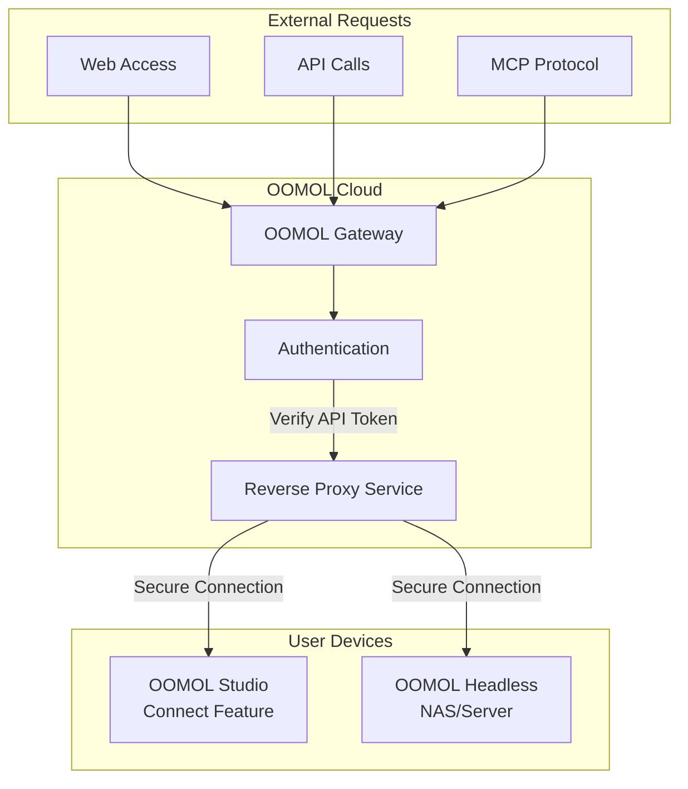

# Connect Service

OOMOL Connect Service is an innovative solution that enables public internet access to OOMOL applications on your local devices without complex network configuration.

## Architecture Overview



### How It Works

1. **External Requests**: Users initiate requests via web, API, or MCP protocol
2. **Gateway Authentication**: OOMOL Gateway verifies the API Token in requests
3. **Reverse Proxy**: After verification, the gateway forwards requests to your device
4. **Local Processing**: Your OOMOL Studio or Headless instance processes the request
5. **Return Results**: Results are sent back through a secure channel

## User Guide

### Using OOMOL Applet

Visit [OOMOL Applet](https://connect.oomol.com/applet) to start using features provided by your devices.

#### Key Features

- **Web Applications**: Use various OOMOL applications directly in your browser
- **AI Chat Integration**: Access your device's capabilities through an AI chat interface
- **Complete Ecosystem**: All OOMOL community packages are available

#### Usage Steps

1. Open [https://connect.oomol.com/applet](https://connect.oomol.com/applet)
2. Log in to your OOMOL account
3. Select the application or feature you want to use
4. Start using - all computation happens on your device

### Device Requirements

- **OOMOL Studio**: Install and enable the Connect feature
- **OOMOL Headless**: Run OOMOL Headless image on NAS or server

## Developer Guide

### 1. Get API Token

Visit [OOMOL Console](https://console.oomol.com/api-key) to obtain your API Token.

**Steps:**
1. Log in to OOMOL Console
2. Navigate to API Key management page
3. Create a new API Key
4. Store your token securely (do not commit to code repositories)

### 2. Choose SDK

OOMOL provides SDKs in multiple languages for easy integration:

#### Python SDK
```bash
pip install oomol-connect-sdk
```

**GitHub**: [oomol-connect-sdk-py](https://github.com/oomol-lab/oomol-connect-sdk-py)

#### TypeScript/JavaScript SDK
```bash
npm install @oomol/connect-sdk
```

**GitHub**: [oomol-connect-sdk-ts](https://github.com/oomol-lab/oomol-connect-sdk-ts)

### 3. Quick Start

#### Python Example

```python
from oomol_connect import Client

# Initialize client
client = Client(api_token="your_api_token_here")

# Call OOMOL application on your device
result = client.run_package(
    package_name="your-package-name",
    params={
        "input": "your input data"
    }
)

print(result)
```

#### TypeScript Example

```typescript
import { Client } from '@oomol/connect-sdk';

// Initialize client
const client = new Client({
  apiToken: 'your_api_token_here'
});

// Call OOMOL application on your device
const result = await client.runPackage({
  packageName: 'your-package-name',
  params: {
    input: 'your input data'
  }
});

console.log(result);
```

### 4. Key Advantages

#### 🌐 Public Internet Access
OOMOL Connect Service assigns a public domain to your computer, enabling server-like access to your local device.

#### 🔒 Secure & Reliable
- API Token authentication
- Encrypted communication channels
- Full control over your data

#### ⚡ High Performance
- Intelligent routing
- Low latency connections
- Automatic load balancing

#### 🔧 Easy Integration
- Multi-language SDK support
- RESTful API interface
- Comprehensive documentation and examples

## Use Cases

### Personal Users
- Access home computer's AI features from anywhere
- Share OOMOL applications with friends
- Access local resources while mobile

### Developers
- Expose local OOMOL applications as API services
- Build SaaS applications powered by OOMOL
- Integrate OOMOL features into existing systems

### Enterprise Users
- Private deployment with data staying in internal network
- Secure public access to internal services
- Build hybrid cloud solutions

## FAQ

### Q: Do I need a public IP address?
A: No. OOMOL Connect Service handles all network configuration. You only need internet connectivity.

### Q: Is my data secure?
A: Yes. All communications are encrypted, and your data remains on your device. The OOMOL gateway only forwards requests.

### Q: Are there traffic limits?
A: Refer to your OOMOL account plan for specific limits.

### Q: Which OOMOL Packages are supported?
A: All OOMOL community packages are supported. Browse the complete list at [OOMOL Packages](https://oomol.com/packages).

## Related Links

- [OOMOL Applet](https://connect.oomol.com/applet) - Web interface
- [OOMOL Console](https://console.oomol.com/api-key) - API Token management
- [Python SDK](https://github.com/oomol-lab/oomol-connect-sdk-py) - For Python developers
- [TypeScript SDK](https://github.com/oomol-lab/oomol-connect-sdk-ts) - For TypeScript/JavaScript developers
- [OOMOL Documentation](https://docs.oomol.com) - Complete documentation
- [OOMOL Community](https://community.oomol.com) - Get help and exchange ideas

## Technical Support

If you encounter any issues:
- Check our [Documentation Center](https://docs.oomol.com)
- Submit issues on [GitHub](https://github.com/oomol-lab)
- Join our [Community Forum](https://community.oomol.com)
