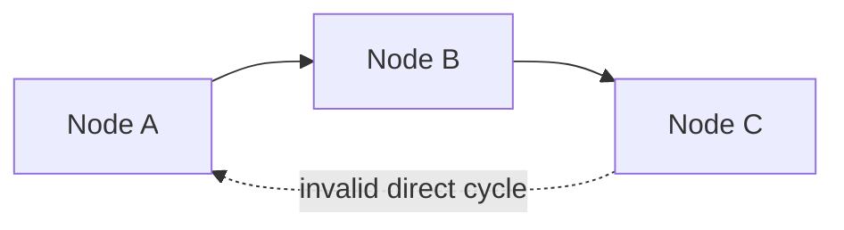

import Image from "@theme/ThemedImage";
import useBaseUrl from "@docusaurus/useBaseUrl";

# Run & Debug

After the [Environment & Dependencies](/docs/get-started/env-and-lib) are prepared, you can start writing Flows and running them.

## Run Preparation

Before running a Flow, check the following:

### Initialization Errors

Make sure the initialization script runs successfully. That confirms the environment and dependencies are ready:

<Image
  sources={{
    light: useBaseUrl("/img/docs/get-started/run-and-debug/run-bootstrap.png"),
    dark: useBaseUrl("/img/docs/get-started/run-and-debug/run-bootstrap.png"),
  }}
/>

### Flow Errors

Make sure the Flow has no obvious issues, such as parameter or wiring problems. You can hover over the highlighted error area to see hints:

<Image
  sources={{
    light: useBaseUrl("/img/docs/get-started/run-and-debug/run-flow-error.png"),
    dark: useBaseUrl("/img/docs/get-started/run-and-debug/run-flow-error.png"),
  }}
/>

The most common Flow authoring issues are:

- A Handle name does not match the upstream or downstream declaration exactly.
- A required input is still unconnected, or its nullable setting does not match the intended usage.
- A task, subflow, or slotflow reference uses the wrong namespace or syntax.
- The graph accidentally contains a direct circular dependency.

Before running, it is worth checking this short list:

1. Verify that connected Handle names match exactly.
2. Verify that required inputs are wired, or intentionally marked nullable.
3. Verify local reusable references such as `task: self::{name}` and `subflow: self::{name}`.
4. Verify that the graph is still a forward data flow, instead of looping back to an upstream Node.

If you intentionally need iterative behavior over arrays, prefer built-in array patterns such as `Map` and `Filter`, or design a reusable subflow, instead of creating a direct cycle in an ordinary Flow.

## Running

Once those issues are resolved, you can run the Flow in several ways:

### Run All

In the top menu of the central panel, click the leftmost run button to run the entire Flow.

<Image
  sources={{
    light: useBaseUrl("/img/docs/get-started/run-and-debug/run-all.png"),
    dark: useBaseUrl("/img/docs/get-started/run-and-debug/run-all.png"),
  }}
/>

This clears previous run records and avoids cache reuse, so it behaves like a full fresh run.

### Run Selected

In the top menu of the central panel, click the second run button from the left to run the selected Nodes.

<Image
  sources={{
    light: useBaseUrl("/img/docs/get-started/run-and-debug/run-selected.png"),
    dark: useBaseUrl("/img/docs/get-started/run-and-debug/run-selected.png"),
  }}
/>

OOMOL Studio resolves the selected Nodes' upstream dependencies and runs from upstream to the selected Nodes.

### Run to Node

In the Node menu, click the run button to run up to the current Node. If upstream Nodes have already run successfully, this mode can reuse [cache](/docs/advanced-guide/universal-block-settings#cache-mechanism) and skip those upstream executions.

<Image
  sources={{
    light: useBaseUrl("/img/docs/get-started/run-and-debug/run-to-node.png"),
    dark: useBaseUrl("/img/docs/get-started/run-and-debug/run-to-node.png"),
  }}
/>

### Run to Node Without Cache

In the Node menu, click `Run Without Cache` to execute all upstream Nodes again and continue up to the current Node.

<Image
  sources={{
    light: useBaseUrl(
      "/img/docs/get-started/run-and-debug/run-to-node-no-cache.png"
    ),
    dark: useBaseUrl(
      "/img/docs/get-started/run-and-debug/run-to-node-no-cache.png"
    ),
  }}
/>

## Logs

After any run, the log panel at the bottom shows the logs for the latest run. New runs replace the previously displayed run logs.

Logs include each Node's inputs and outputs, along with anything written to standard output by your code.

<Image
  sources={{
    light: useBaseUrl("/img/docs/get-started/run-and-debug/run-log.png"),
    dark: useBaseUrl("/img/docs/get-started/run-and-debug/run-log.png"),
  }}
/>

### Features

#### Filtering

All Nodes involved in the run appear in the left sidebar. Clicking a Node filters the log view to that Node.

<Image
  sources={{
    light: useBaseUrl("/img/docs/get-started/run-and-debug/run-log-filter.png"),
    dark: useBaseUrl("/img/docs/get-started/run-and-debug/run-log-filter.png"),
  }}
/>

#### Searching

The search box lets you search log content by keyword. Search is case-sensitive.

<Image
  sources={{
    light: useBaseUrl("/img/docs/get-started/run-and-debug/run-log-search.png"),
    dark: useBaseUrl("/img/docs/get-started/run-and-debug/run-log-search.png"),
  }}
/>

#### Uncaptured Logs

Switch the menu next to the search bar to `Studio` to show uncaptured internal logs from OOMOL Studio.

<Image
  sources={{
    light: useBaseUrl("/img/docs/get-started/run-and-debug/run-log-studio.png"),
    dark: useBaseUrl("/img/docs/get-started/run-and-debug/run-log-studio.png"),
  }}
/>

These logs usually appear only in edge cases where an internal exception was not captured in the normal workflow log.

#### Export

You can export the full logs of the current run to a specified folder.

Exported logs include internal scheduler and executor logs, which are mainly useful when diagnosing application-level failures.

<Image
  sources={{
    light: useBaseUrl("/img/docs/get-started/run-and-debug/run-log-export.png"),
    dark: useBaseUrl("/img/docs/get-started/run-and-debug/run-log-export.png"),
  }}
/>

:::info
If the log output is too large, OOMOL Studio may avoid rendering all of it directly to prevent UI instability. You can still inspect the full output through log export.
:::

If you encounter unresolved exceptions after running the Flow, try exporting the run logs and sending them to OOMOL Studio's official support at `support@oomol.com` for assistance.
