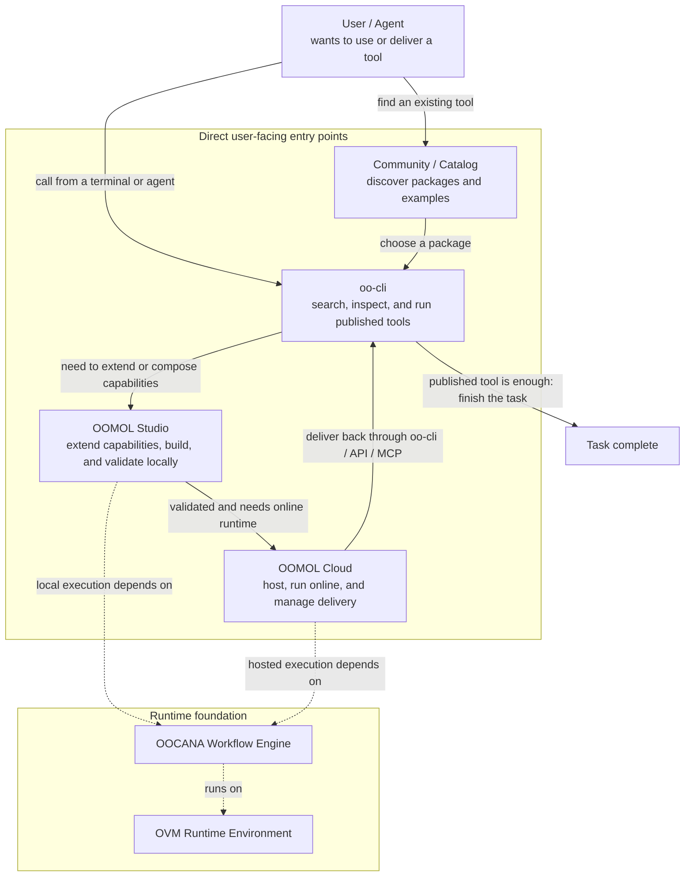

<section className="docs-overview-intro">
  <h1>Docs for AI-assisted reading</h1>
  

    OOMOL docs are designed to be read, searched, and summarized by AI. Give the
    complete docs site to your AI assistant first, let it understand the product
    structure, commands, and workflows, then ask questions directly.
  

  

    For questions inside OOMOL Studio, use the Oopilot panel on the right side
    of Studio.
  

</section>

## The Main Path

### 1. oo-cli

Use `oo-cli` when you want agents to search, inspect, and run published tools
first.

- Best starting point for Codex, Claude Code, terminal workflows, and other agents
- Covers official install and update flows, auth, search, inspection, connector execution, Cloud Task operations, skills, files, logs, and shell completion
- Keeps the shortest path when a published package, connector action, or skill already solves the job

### 2. OOMOL Studio

Move to OOMOL Studio when published tools stop short and you need to build or
extend your own implementation.

- Generate and edit function tools in a real coding environment
- Validate the same implementation locally before you ship it anywhere
- Compose connectors, workflows, dependencies, and custom logic without splitting work across separate tools

### 3. OOMOL Cloud

Use OOMOL Cloud after the implementation is validated and needs hosting or
delivery back into the main `oo-cli` path.

- Keep runtime settings, secrets, access control, and release relationships in one place
- Deliver the same validated implementation through OOMOL-hosted surfaces instead of rebuilding another backend around it
- Keep `oo-cli` as the primary delivery path for agents, with APIs, MCP, and automation available as optional surfaces when needed

## How The Docs Are Organized

- [oo-cli](/docs/oo-cli): start here if you want to use published tools through agents or terminal workflows
- [OOMOL Studio](/docs/studio/overview): use this when you need to build, extend, and validate your own tools
- [Cloud Function](/docs/cloud-services/cloud-function): use this when the validated tool needs hosting, hosted delivery, or managed access
- [Support](/docs/community): use this for publishing, community, and related operational topics

## User Path And Product Layers

Read the upper part first as the user path:

- To find existing capabilities, start from the community or catalog, then use `oo-cli` to search, inspect, and run packages.
- When existing capabilities are not enough, use OOMOL Studio to extend functionality or compose your own workflow.
- When the tool is validated and needs online runtime, continuous delivery, or managed configuration, use OOMOL Cloud.

The lower part is the runtime foundation, not the first entry point for most
users:

- `OOCANA` is the workflow engine behind execution.
- `OVM` provides the runtime environment used by OOMOL Studio and related tooling.
