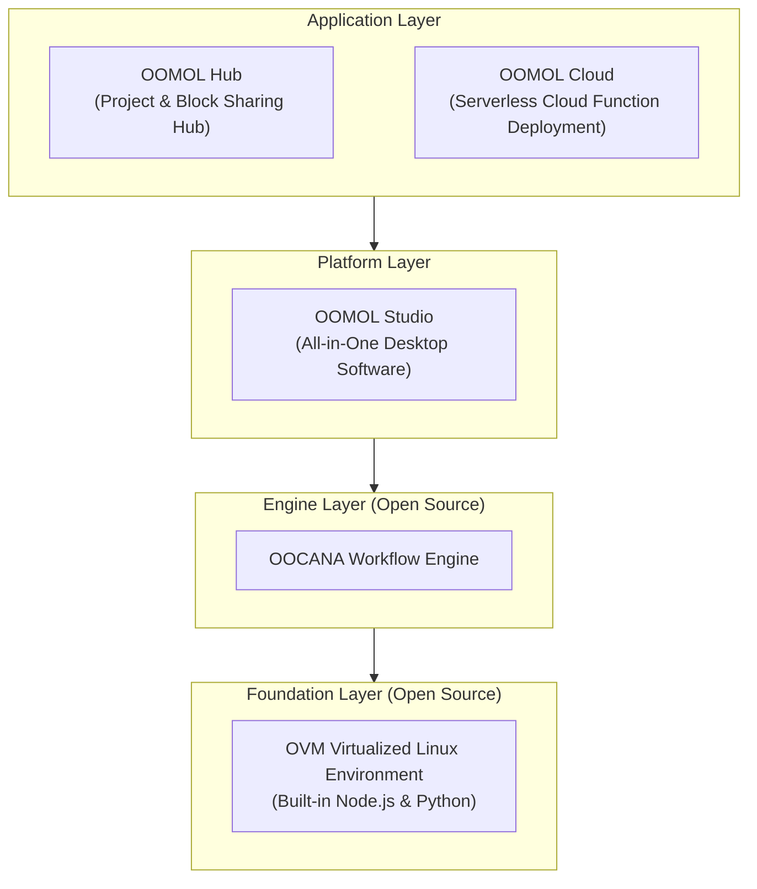

import desktop from "@site/static/img/docs/desktop.png";
import hub from "@site/static/img/docs/hub.png";
import hub_detail from "@site/static/img/docs/hub_detail.png";
import desktop_detail from "@site/static/img/docs/desktop_detail.png";
import ResponsiveVideo from "@site/src/components/mdx/ResponsiveVideo";

  Have a question? Ask Agent. Have a task? Let Agent do it.

The docs are mainly for developers to look things up and for search engines to understand the product's capabilities.

<ResponsiveVideo
  src="https://cloud-storage.oomol.com/users/019343aa-ff25-727c-a449-9017313539b0/chat-uploads/2026-03-23/4gxes_hu5_ua-OOMOL_Studio.webm"
  type="video/webm"
  controls
  autoPlay
  muted
  loop
  playsInline
  preload="metadata"
  poster={desktop}
/>

## Core Features

OOMOL is an AI-driven workflow platform for data analysis, automation, and agent building. Compared with similar products, it puts more emphasis on the open-source ecosystem and developer programmability.

### Open Source

Our business model is straightforward: the underlying execution engine is fully open source, while the higher-level applications provide productized convenience and hosted services.

- The execution engine is open source, so developers can understand how it works and customize it when needed
- Container image export is planned to make cross-platform deployment easier

### Programmable

At the core is the Scriptlet Block, which lets developers implement custom logic in Python or Node.js.

- Traditional workflow tools often limit users to predefined modules, which constrains real-world implementation
- OOMOL connects workflows with the broader open-source ecosystem, so you can call libraries directly inside workflows

### AI Native

- Built-in AI-assisted coding to lower the barrier to entry
- Supports agent-driven authoring based on model function calling
- Includes multiple AI models that developers can use directly without complex setup

## Product Architecture

### OOMOL STUDIO

> OOMOL Desktop App

1. Convenient drag-and-drop workflows
2. Professional code editor
3. Elegant data visualization capabilities

### OOMOL Hub

> OOMOL Sharing Center

1. Share your creative work
2. Collaborate on projects with community members
3. Find inspiration from the community

### OOMOL Cloud

> OOMOL Cloud Function Service

1. Web-based access without local installation
2. Use cloud compute when local execution is not enough
3. Expose capabilities through APIs and other integration surfaces

### OVM

> OOMOL Virtual Machine

1. Provides isolated container environments, ensuring security and portability
2. Built-in multi-language development environment, ready to use out of the box

**Open Source Repositories**

- https://github.com/oomol-lab/ovm
- https://github.com/oomol-lab/ovm-core
- https://github.com/oomol-lab/ovm-win
- https://github.com/oomol-lab/ovm-js

### OOCANA

> OOMOL Workflow Engine

1. Responsible for block scheduling
2. Throughput management

**Open Source Repositories**

- https://github.com/oomol/oocana-node
- https://github.com/oomol/oocana-python
- https://github.com/oomol/oocana-rust
