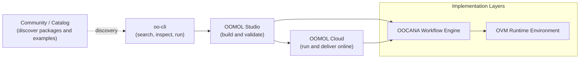

import desktop from "@site/static/img/docs/desktop.png";
import ResponsiveVideo from "@site/src/components/mdx/ResponsiveVideo";

  Start with oo-cli. Build in Studio when published tools stop short. Deliver
  through Cloud when it needs to keep running.

These docs follow the same path as the main site. If you only need to use
published tools, start with `oo-cli`. If you need to build or extend your own,
move into OOMOL Studio. If the validated tool needs hosting, hosted delivery,
or managed access, continue with OOMOL Cloud.

<ResponsiveVideo
  src="https://cloud-storage.oomol.com/users/019343aa-ff25-727c-a449-9017313539b0/chat-uploads/2026-03-23/4gxes_hu5_ua-OOMOL_Studio.webm"
  type="video/webm"
  controls
  autoPlay
  muted
  loop
  playsInline
  preload="metadata"
  poster={desktop}
/>

## The Main Path

### 1. oo-cli

Use `oo-cli` when you want agents to search, inspect, and run published tools
first.

- Best starting point for Codex, Claude Code, terminal workflows, and other agents
- Covers discovery, inspection, connector execution, Cloud Task runs, skills, files, and auth
- Keeps the shortest path when the job is already solved by something published

### 2. OOMOL Studio

Move to OOMOL Studio when published tools stop short and you need to build or
extend your own implementation.

- Generate and edit function tools in a real coding environment
- Validate the same implementation locally before you ship it anywhere
- Compose connectors, workflows, dependencies, and custom logic without splitting work across separate tools

### 3. OOMOL Cloud

Use OOMOL Cloud after the implementation is validated and needs hosting or
delivery back into the main `oo-cli` path.

- Keep runtime settings, secrets, access control, and release relationships in one place
- Deliver the same validated implementation through OOMOL-hosted surfaces instead of rebuilding another backend around it
- Keep `oo-cli` as the primary delivery path for agents, with APIs, MCP, and automation available as optional surfaces when needed

## How The Docs Are Organized

- [oo-cli](/docs/oo-cli): start here if you want to use published tools through agents or terminal workflows
- [OOMOL Studio](/docs/concepts/project): use this when you need to build, extend, and validate your own tools
- [Cloud Function](/docs/cloud-services/cloud-function): use this when the validated tool needs hosting, hosted delivery, or managed access
- [Support](/docs/community): use this for publishing, community, and related operational topics

## Product Layers

The open-source layers are still important, but they are not the first stop for
most users:

- `OOCANA` is the workflow engine behind execution
- `OVM` provides the runtime environment used by OOMOL Studio and related tooling

If you are new to the product, start with the user path above and go deeper
into the engine layers only when you need implementation detail.
