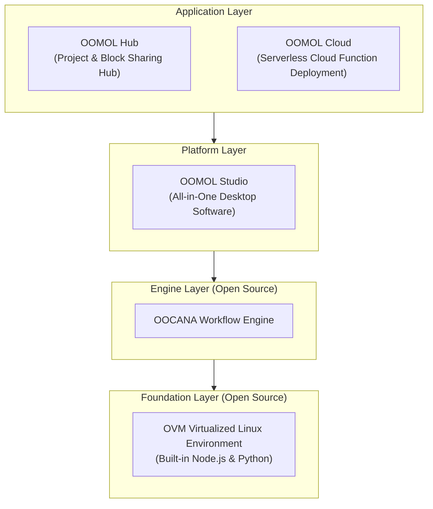

import desktop from "@site/static/img/docs/desktop.png";
import hub from "@site/static/img/docs/hub.png";
import hub_detail from "@site/static/img/docs/hub_detail.png";
import desktop_detail from "@site/static/img/docs/desktop_detail.png";

<h1 className="docs-overview-sr-only">Overview</h1>

  

    
Ask Agent first. Read details later.

    

      With OOMOL Studio, you do not need to read every chapter carefully.
    

    

      Ask the Agent inside Studio how to do something. If the goal is already
      clear, just let the Agent do it for you. The docs are here when you need
      exact settings, references, and deeper explanations.
    

    

      

        Not sure how to start
        <strong>Ask Agent directly</strong>
        

          Let it explain the steps, the blocks you need, and the fastest way to begin.
        

      

      

        Already know the goal
        <strong>Let Agent execute</strong>
        

          Describe the outcome and let it build the workflow, adjust parameters, and add code.
        

      

    

  

  

    

      Demo Video
      <small>Watch this first, then decide how much documentation you need</small>
    

    <video
      className="docs-overview-video"
      controls
      autoPlay
      muted
      loop
      playsInline
      preload="metadata"
      poster={desktop}
    >
      <source
        src="https://cloud-storage.oomol.com/users/019343aa-ff25-727c-a449-9017313539b0/chat-uploads/2026-03-23/4gxes_hu5_ua-OOMOL_Studio.webm"
        type="video/webm"
      />
    </video>
  

## Core Features

OOMOL is an AI-driven workflow platform designed for data analysis, automation script development, and intelligent agent construction. Compared to similar products, we focus more on open-source ecosystem and programmability.

### Open Source

Our business model: The underlying execution engine is completely open source, while the upper-level applications serve as value-added conveniences.

- Open-source underlying execution engine, making it easy for developers to understand our operating principles and customize functionality
- Support for exporting container images, enabling seamless cross-platform deployment (in development)

### Programmable

Our core is the Scriptlet Block, which allows developers to implement custom business logic using Python and Node.js.

- Traditional workflow products typically limit users to predefined modules, restricting business implementation
- We seamlessly integrate workflows with the vast open-source ecosystem, allowing direct use of various open-source libraries in workflows, giving the product unlimited possibilities

### AI Native

- Integrated AI-assisted programming capabilities to lower coding barriers
- Support for automated programming based on large model function calling
- Built-in variety of AI models that developers can use directly without complex configuration

## Product Architecture

### OOMOL STUDIO

> OOMOL Desktop App

1. Convenient drag-and-drop workflows
2. Professional code editor
3. Elegant data visualization capabilities

### OOMOL Hub

> OOMOL Sharing Center

1. Share your creative work
2. Collaborate on projects with community members
3. Find inspiration from the community

### OOMOL Cloud

> OOMOL Cloud Function Service

1. Web access, available anytime without download
2. Leverage unlimited cloud computing power
3. Support for API integration, providing services for developers

### OVM

> OOMOL Virtual Machine

1. Provides isolated container environments, ensuring security and portability
2. Built-in multi-language development environment, ready to use out of the box

**Open Source Repositories**

- https://github.com/oomol-lab/ovm
- https://github.com/oomol-lab/ovm-core
- https://github.com/oomol-lab/ovm-win
- https://github.com/oomol-lab/ovm-js

### OOCANA

> OOMOL Workflow Engine

1. Responsible for block scheduling
2. Throughput management

**Open Source Repositories**

- https://github.com/oomol/oocana-node
- https://github.com/oomol/oocana-python
- https://github.com/oomol/oocana-rust
