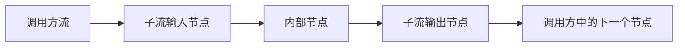
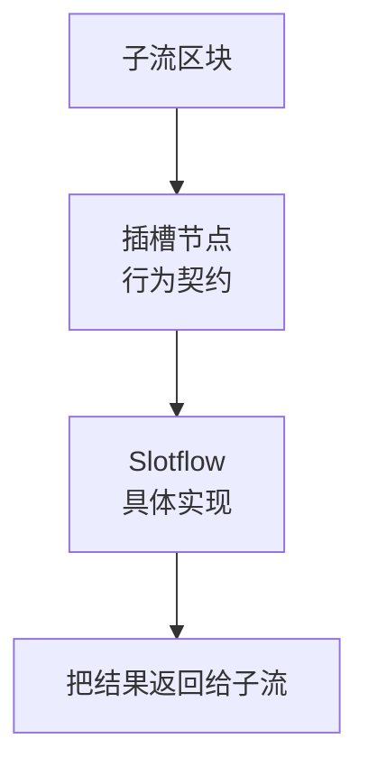
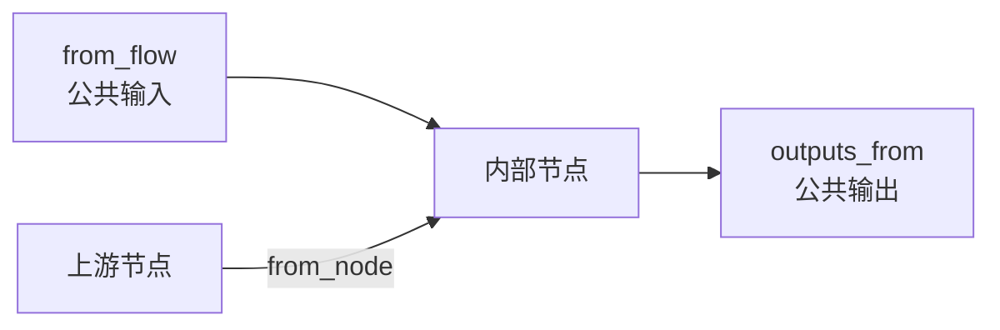
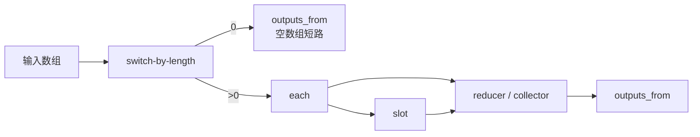

import Image from "@theme/ThemedImage";
import useBaseUrl from "@docusaurus/useBaseUrl";

# 子流区块进阶用法

创建子流区块后，你可以点击左侧共享区块栏中的对应子流区块，进入它的编辑页面。

在编辑页面底部，可以看到“区块模式”和“工作流模式”两个模式。

<Image
  sources={{
    light: useBaseUrl(
      "/img/docs/advanced-guide/advanced-block-usage/subflow-block-view.png"
    ),
    dark: useBaseUrl(
      "/img/docs/advanced-guide/advanced-block-usage/subflow-block-view.png"
    ),
  }}
  width="720"
/>

在区块模式中的配置与[通用区块设置](/zh-CN/docs/advanced-guide/universal-block-settings) 中的配置基本一致，这里主要介绍工作流模式下的用法。

## 在复用模型中的位置

子流区块位于普通流和任务区块之间：

| 概念 | 最适合做什么 | 文件形式 |
| --- | --- | --- |
| 流 | 最终可运行逻辑、实验、测试、调试 | `flow.oo.yaml` |
| 任务区块 | 一个稳定的单一操作 | `task.oo.yaml` |
| 子流区块 | 一段可复用的多步骤逻辑 | `subflow.oo.yaml` |
| Slotflow | 为某个插槽提供实现 | `slotflow.oo.yaml` |

一个常见过程是：

1. 先在普通流里把逻辑做通并验证。
2. 把其中重复出现的多步骤部分提取成子流区块。
3. 把可能变化的行为保留为插槽，让不同调用方各自实现。

## 输入输出节点

在进入到工作流模式后，可以看到工作流界面中多了两个特殊节点：

<Image
  sources={{
    light: useBaseUrl(
      "/img/docs/advanced-guide/advanced-block-usage/subflow-flow-view.png"
    ),
    dark: useBaseUrl(
      "/img/docs/advanced-guide/advanced-block-usage/subflow-flow-view.png"
    ),
  }}
  width="720"
/>

这两个节点其实对应的是区块模式下的输入和输出接口，如果你的子流没有接入到输入和输出接口，那么子流就无法从外部获取到输入并产生输出。

输入输出节点的使用方法与区块模式下的输入和输出接口基本一致，只是多了一个快捷创建接口的操作：

<Image
  sources={{
    light: useBaseUrl(
      "/img/docs/advanced-guide/advanced-block-usage/subflow-block-quick-create-handle.gif"
    ),
    dark: useBaseUrl(
      "/img/docs/advanced-guide/advanced-block-usage/subflow-block-quick-create-handle.gif"
    ),
  }}
  width="720"
/>

快捷创建的接口会复制连接接口的名称和类型。

在输入和输出节点创建的接口也会反映到区块模式下的输入输出接口中，反之也会同步。

输入输出节点无法删除，如果用户不需要输入或者输出可以选择不连线。

从建模角度看，这两个节点就是子流的公共边界。它们之间的连线和节点是子流内部实现细节，它们上面暴露出来的接口才是子流对外的契约。



## 插槽

插槽是一个专用于子流区块的共享区块，仅有在子流区块的工作流编辑模式下才会出现在右侧系统区块栏中。

<Image
  sources={{
    light: useBaseUrl(
      "/img/docs/advanced-guide/advanced-block-usage/subflow-block-slot-position.png"
    ),
    dark: useBaseUrl(
      "/img/docs/advanced-guide/advanced-block-usage/subflow-block-slot-position.png"
    ),
  }}
  width="720"
/>

### 插槽的意义

有些时候，子流区块开发者只关心“这里需要一种能力”，却不想把能力的具体实现写死，或者本来就希望由调用方自行实现。插槽就是为这种场景设计的，它可以把一部分行为实现权交给调用方。

> 例如：子流区块开发者需要通过 AI 分析数据，所以开发者定义了一个插槽，插槽的输入是数据内容，输出是分析结果字符串。然后用户可以根据自己拥有的 AI 密钥来实现不同的 AI 分析区块，并使用自己的 API token。

另外，子流区块也可以把那些经常变化的部分提取成插槽。这样在具体使用时就可以灵活替换，而不必频繁修改子流内部的关键逻辑。

> 例如：开发者依赖了一个更新十分频繁的第三方库，他可以定义一个插槽，插槽的输入是传递给三方库的输入，输出是三方库的输出，然后将子流发布。这样可以在外部将三方库接入到子流，在三方库更新的时候仅更新外部区块，而子流不需要更新。

插槽本身也是一个区块，但只有输入和输出接口可以配置。

### 使用方式

插槽与普通共享区块的使用方式类似，可以拖入到工作流中进行连线：

<Image
  sources={{
    light: useBaseUrl(
      "/img/docs/advanced-guide/advanced-block-usage/subflow-block-slot-use.png"
    ),
    dark: useBaseUrl(
      "/img/docs/advanced-guide/advanced-block-usage/subflow-block-slot-use.png"
    ),
  }}
  width="720"
/>

不同之处在于，你可以直接在插槽区块上修改接口名称和参数。

在添加并连接插槽后，回到区块模式可以看到子流区块多了一个插槽栏：

<Image
  sources={{
    light: useBaseUrl(
      "/img/docs/advanced-guide/advanced-block-usage/subflow-block-slot-ui.png"
    ),
    dark: useBaseUrl(
      "/img/docs/advanced-guide/advanced-block-usage/subflow-block-slot-ui.png"
    ),
  }}
  width="720"
/>

这里的插槽栏仅用于展示。

当子流区块在工作流中被使用时，你可以点击插槽的设置按钮来进入插槽的编辑界面：

<Image
  sources={{
    light: useBaseUrl(
      "/img/docs/advanced-guide/advanced-block-usage/subflow-block-slot-inflow.png"
    ),
    dark: useBaseUrl(
      "/img/docs/advanced-guide/advanced-block-usage/subflow-block-slot-inflow.png"
    ),
  }}
  width="720"
/>

插槽的编辑界面与子流的编辑界面基本一致。你也可以把插槽理解为一种更特殊的子流：

<Image
  sources={{
    light: useBaseUrl(
      "/img/docs/advanced-guide/advanced-block-usage/subflow-block-slot-edit.png"
    ),
    dark: useBaseUrl(
      "/img/docs/advanced-guide/advanced-block-usage/subflow-block-slot-edit.png"
    ),
  }}
  width="720"
/>

插槽内也有输入输出节点，你可以在插槽内插入一个或多个节点，这点与子流的编辑方法一致。

编辑完成后，回到工作流界面就可以运行子流区块：

<Image
  sources={{
    light: useBaseUrl(
      "/img/docs/advanced-guide/advanced-block-usage/subflow-block-run.png"
    ),
    dark: useBaseUrl(
      "/img/docs/advanced-guide/advanced-block-usage/subflow-block-run.png"
    ),
  }}
  width="720"
/>

子流区块的运行方式与普通区块基本一致，区别只在于：如果某个插槽是运行所必需的，那么必须先补全插槽内容，否则运行条件不成立。

## Slotflow

当一个带有插槽的子流被放进调用方流里使用时，每个插槽实际上都需要一个小型工作流来实现，这个小型工作流通常可以称为 `slotflow`。

可以把这几个概念理解成下面的关系：



- 插槽定义它会向外提供哪些输入，以及期望收到哪些输出。
- slotflow 负责提供这份契约的具体实现。
- 同一个子流，在不同调用方流中可以接入不同的 slotflow。

这也是子流既能复用整体结构，又不需要把所有内部策略都写死的原因。

## 转发预览

一个子流内部可能有很多节点，其中多个节点都可能产生预览。但对于可复用子流来说，调用方通常不需要看到所有内部预览。更常见的做法是把最重要的预览选择性地转发到外部。

```yaml
forward_previews:
  - files-downloader#1
```

这在“内部图比较复杂，但仍希望调用方流能看到 1 到 2 个关键预览”的场景里尤其有用。

比较好的实践是：

- 只转发对最终用户最有价值的 1 到 2 个预览。
- 优先转发能体现进度、或能展示关键产物的预览。
- 不要默认把所有内部预览都转发出去，否则子流的封装边界会变得很弱。

关于预览 API 本身，可以继续参考 [Node.js SDK API](/zh-CN/docs/workflow-engine/nodejs-sdk-api#contextpreview-types) 或 [Python SDK API](/zh-CN/docs/workflow-engine/python-sdk-api#contextpreview-类型)。

## 数据路由模型

如果你通过 YAML 直接编写子流，或者想更精确地理解数据是如何流动的，下面这些概念最关键：

| 字段 | 含义 |
| --- | --- |
| `inputs_def` | task、subflow 或 slot 对外声明的输入 |
| `outputs_def` | task、subflow 或 slot 对外声明的输出 |
| `inputs_from` | 某个节点的每个输入来自哪里 |
| `outputs_from` | subflow 或 slotflow 如何把内部结果暴露给外部 |
| `from_flow` | 从当前 subflow 或 slotflow 的外层边界读取数据 |
| `from_node` | 从另一个内部节点读取数据 |

在图形界面里，这些本质上就是“连线”；在作者视角里，它们组成了一个可复用单元的输入输出契约。



其中有两条规则尤其重要：

1. 子流的公共输出，必须从某个内部结果路由出去。
2. 插槽声明的输出名与 slotflow 返回的输出名必须精确匹配，否则子流拿不到预期结果。

如果某个公共输出同时配置了多个内部来源，那么会以第一个合法完成的来源作为对外结果。这种能力很适合处理空数组短路这类分支。

## YAML 中的引用形式

如果你需要直接编辑 YAML，最常见的本地引用形式如下：

| 用途 | 写法 |
| --- | --- |
| 引用本地任务 | `task: self::{name}` |
| 引用本地子流 | `subflow: self::{name}` |
| 引用本地 slotflow | `slotflow: self::+slotflow#N` |

如果复用单元来自其他包，则把 `self::` 换成对应的包命名空间即可。

## 编写规则

图形界面会帮你隐藏很多文件结构细节，但底层模型仍然遵循一些稳定规则：

- 子流如果要把结果暴露给调用方，就必须有根级别的 `outputs_from`。
- 插槽节点除了声明输入输出外，自己也仍然需要连接上游输入。
- 如果插槽需要额外参数，调用方流里既要声明这些参数，也要把它们接线进去。
- slotflow 的输出应该与插槽契约严格一致。
- 如果子流可能通过多个合法分支结束，它的公共输出可以从多个内部来源路由出来。
- 可选接口通常可以使用 `nullable` 表达；当默认值本来就应该为空时，留空比人为制造占位值更清晰。

这种“多来源公共输出”的能力，常用于空数组短路这类场景。

## 典型数组模式

内置的 `Map` 和 `Filter` 风格子流，就是标准数组处理模式的典型例子：



这套模式之所以常见，是因为：

- `self::switch-by-length` 可以清晰地区分空数组与非空数组。
- `self::each` 负责逐项发出迭代数据。
- `switch-by-length` 可以先处理空数组分支。
- `each` 会逐项发出元素，以及索引、长度等元信息。
- `slot` 让每一项的处理逻辑保持可替换。
- `reducer` 或 collector 节点负责把最终结果累积起来。

如果你要设计一个可复用的多项处理流程，这种模式通常比把所有逻辑塞进一个大脚本节点里更容易维护。

如果你想看 `inputs_def`、`outputs_from`、`self::` 这类字段和引用形式的集中说明，可以继续参考 [Flow YAML 编写](/zh-CN/docs/advanced-guide/flow-yaml-authoring)。
