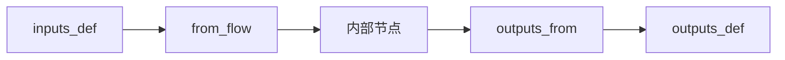
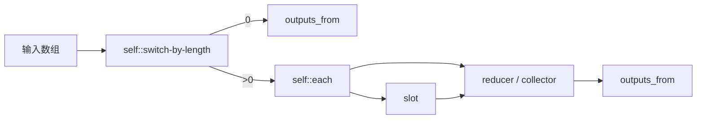

# Flow YAML 编写

大多数用户完全可以只通过 OOMOL Studio 的图形界面构建流。这个页面主要面向希望直接理解或编辑底层 YAML 模型的用户。

如果你想看 secret、OOMOL 认证、Fusion 优先以及 `sessionDir` 回退模式的编写规则，可以继续参考 [Secrets、认证与运行路径](/zh-CN/docs/advanced-guide/secrets-auth-and-runtime-paths)。

## 复用单元存放在哪里

最常见的几类编写单元通常放在这些目录里：

| 单元 | 目录 | 主文件 |
| --- | --- | --- |
| 流 | `flows/{name}/` | `flow.oo.yaml` |
| 任务区块 | `tasks/{name}/` | `task.oo.yaml` |
| 子流区块 | `subflows/{name}/` | `subflow.oo.yaml` |
| Slotflow | `slotflows/+slotflow#N/` | `slotflow.oo.yaml` |

可以这样理解：

- 流是可运行入口。
- 任务区块是可复用的单一操作。
- 子流区块是可复用的多步骤工作流。
- slotflow 是用于实现插槽契约的小型工作流。

## 引用形式

最常见的本地引用写法如下：

| 你想引用什么 | YAML 写法 |
| --- | --- |
| 本地任务 | `task: self::{name}` |
| 本地子流 | `subflow: self::{name}` |
| 本地 slotflow | `slotflow: self::+slotflow#N` |

如果目标来自其他包，只需要把 `self::` 换成对应的包命名空间。

## 公共契约与内部接线

OOMOL 的 YAML 会把两件事分开表达：

| 关注点 | 常见字段 | 含义 |
| --- | --- | --- |
| 公共契约 | `inputs_def`、`outputs_def` | 这个复用单元对外接收什么、返回什么 |
| 内部接线 | `inputs_from`、`outputs_from`、`from_flow`、`from_node` | 数据如何在边界和内部节点之间流动 |



## 核心字段

### `long_running`

主要用于 `task.oo.yaml`，表示这个任务预期会比普通任务运行更久。

```yaml
long_running: true
```

推荐使用规则：

- 默认省略这个字段，或保持为 `false`。
- 只有在任务明确属于长时任务时才使用 `true`，通常指 10 分钟以上，或者明显受输入规模影响的处理。
- 不要把一次性 API 调用、短格式转换或普通快速任务标成 `long_running`。

### `inputs_def`

定义 task、subflow 或 slot 对外接收的输入接口。

```yaml
inputs_def:
  - handle: array
    json_schema:
      type: array
```

### `outputs_def`

定义这个复用单元承诺会返回哪些输出接口。

```yaml
outputs_def:
  - handle: result
    json_schema:
      type: string
```

### `inputs_from`

定义某个节点的每个输入是从哪里拿到的。

```yaml
inputs_from:
  - handle: text
    from_node:
      - node_id: reader#1
        output_handle: text
```

输入来源通常有三种：

- `from_node`：从当前 Flow 或子流内部的另一个节点读取
- `from_flow`：从当前 subflow 或 slotflow 的公共边界读取
- `value`：直接使用内联值

### `outputs_from`

定义 subflow 或 slotflow 如何把内部结果暴露到外部。

```yaml
outputs_from:
  - handle: result
    from_node:
      - node_id: formatter#1
        output_handle: text
```

如果根级别没有 `outputs_from`，那么一个子流即使内部运行完成，也可能对外没有可用输出。

### `forward_previews`

用于 `subflow.oo.yaml`，表示把子流内部选定节点的预览转发给调用方 Flow。

```yaml
forward_previews:
  - files-downloader#1
```

这能让一个内部实现较复杂的子流，在外部仍只暴露最有价值的预览结果。

推荐使用规则：

- 只转发对调用方最重要的 1 到 2 个预览。
- 优先选择产物预览或进度相关预览。
- 不要默认转发所有内部预览。

## 常见接线模式

### 在 Flow 中调用任务节点

```yaml
nodes:
  - node_id: summarize#1
    task: self::summarize
    inputs_from:
      - handle: text
        from_node:
          - node_id: reader#1
            output_handle: text
```

### 在 Flow 中调用子流节点

```yaml
nodes:
  - node_id: filter#1
    subflow: self::filter
    inputs_from:
      - handle: array
        from_node:
          - node_id: +value#1
            output_handle: array
```

### 给子流插槽绑定 slotflow

```yaml
nodes:
  - node_id: filter#1
    subflow: self::filter
    slots:
      - slot_node_id: +slot#1
        slotflow: self::+slotflow#1
```

## 插槽契约

插槽是在子流内部定义的一段行为边界：

```yaml
- node_id: +slot#1
  node_type: slot_node
  slot:
    inputs_def:
      - handle: item
        json_schema: {}
    outputs_def:
      - handle: predicate
        json_schema:
          type: boolean
```

这里有几条关键规则：

- 插槽除了声明契约，也仍然需要 `inputs_from` 才能接到上游数据。
- slotflow 返回的输出名，必须和插槽期望的公共输出名完全一致。
- 如果插槽需要额外参数，通常要在调用方 Flow 中同时声明并接线。

## Nullable 与默认值

可选接口通常可以通过 `nullable` 来表达。

```yaml
inputs_def:
  - handle: output_dir
    json_schema:
      type: string
    nullable: true
```

如果一个默认值本来就应该为空，通常保留空 `value:` 会比人为制造一个占位值更清晰。

## 多来源输出

有些子流可能通过多个合法分支结束。这种情况下，一个公共输出可以从多个内部来源路由出来：

```yaml
outputs_from:
  - handle: array
    from_node:
      - node_id: reducer#1
        output_handle: array
      - node_id: switch-by-length#1
        output_handle: "0"
```

这种模式很常用于空数组短路这类场景。

## 面向数组的子流模式

可复用的数组处理子流，通常会采用下面这样的结构：



这套模式有助于把空数组处理、逐项行为、最终聚合拆开管理。

## 校验清单

在怀疑运行时有问题之前，建议先检查这几条编写规则：

1. 接口名必须完全一致。
2. 必填输入必须连接，除非它是有意设计成可空的。
3. 本地复用单元引用应使用正确的命名空间形式，例如 `self::`。
4. 子流应通过根级别 `outputs_from` 把公共结果暴露出去。
5. 插槽输出与 slotflow 输出应使用相同的接口名。
6. 普通 Flow 中不应出现直接循环依赖。

如果你想看图形界面视角下对子流和插槽的说明，可以继续参考[子流区块进阶用法](/zh-CN/docs/advanced-guide/advanced-subflow-block)。
