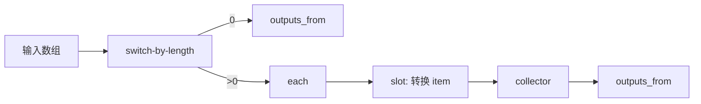
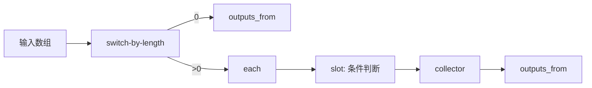
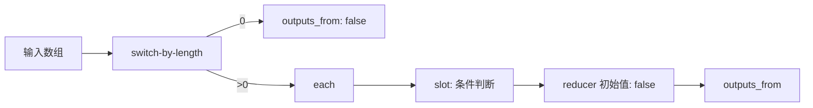
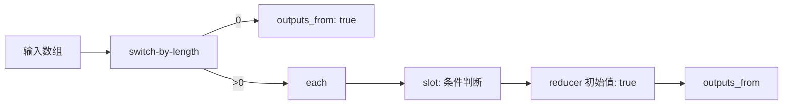
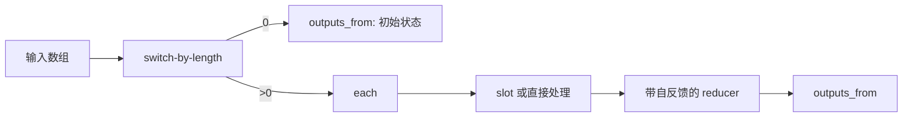
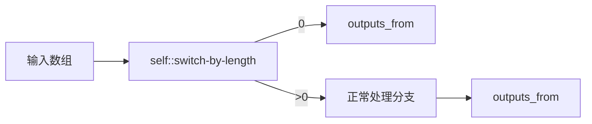
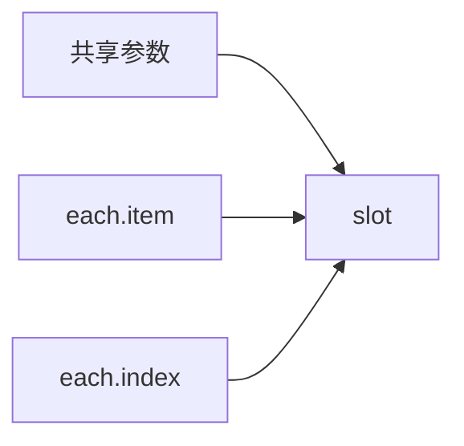

# 子流模式手册

这一页收集常见的可复用子流模式。它更像一本设计 cookbook：当你知道自己想实现什么行为时，先找到最接近的模式，再据此调整。

如果你想查 `inputs_from`、`outputs_from` 这类 YAML 字段定义，请继续参考 [Flow YAML 编写](/zh-CN/docs/advanced-guide/flow-yaml-authoring)。

## 如何选择模式

| 目标 | 常见模式 |
| --- | --- |
| 把每一项转换成另一项 | `map` |
| 只保留满足条件的项 | `filter` |
| 返回“是否至少有一项满足条件” | `some` |
| 返回“是否所有项都满足条件” | `every` |
| 把多项累计成一个结果 | `reduce` / collector |
| 尽早拆分空数组与非空数组 | `switch-by-length` + 多来源 `outputs_from` |

## Map

当每个输入项都应该产生一个输出项时，使用 `map`。

适合场景：

- 重命名文件
- 格式化字符串
- 把对象转换成另一套结构

关键规则：

- 插槽返回的应该是“转换后的项”，而不是布尔条件。

## Filter

当每个元素都只需要产出一个“保留/丢弃”的判断时，使用 `filter`。

适合场景：

- 保留有效记录
- 删除被屏蔽的域名
- 选择通过测试的图片

关键规则：

- 插槽应该为每项返回一个布尔型判断。

## Some

当最终结果是一个布尔值，表示“是否至少有一项满足条件”时，使用 `some`。

适合场景：

- 检查是否有任意文件过大
- 检查是否有任意消息包含关键词
- 检查是否有任意步骤未通过

关键规则：

- reducer 的初始值通常应为 `false`。

## Every

当最终结果是一个布尔值，表示“是否所有项都满足条件”时，使用 `every`。

适合场景：

- 确认所有必需文件都存在
- 确认所有输出都合法
- 确认所有项都通过审核

关键规则：

- reducer 的初始值通常应为 `true`。

## Reduce / Collector

当多项数据需要累计为一个结构化结果时，使用 `reduce`。

适合场景：

- 构建汇总对象
- 统计分类数量
- 按 key 分组
- 从多条记录生成报表

关键规则：

- 使用单独的 reducer 初始值节点。
- 把 reducer 的输出回接到 reducer 的输入。
- 选择和最终结果类型一致的初始值。

## 空数组短路

很多可复用的数组子流都应该显式处理空数组。

这么做的原因是：

- 空数组的行为会更可预测。
- 可以避免无意义的额外计算。
- 能避免 reducer 或插槽基于错误的长度假设继续执行。

## 给插槽传递额外参数

有时逐项处理逻辑还需要共享参数，例如前缀、阈值、API 设置等。

适合场景：

- `map` 中的前缀文本
- `filter` 中的阈值
- `reduce` 中的分类规则

关键规则：

- 先声明这些额外插槽输入。
- 再在调用方 Flow 中把它们接入插槽。
- 尽量保持插槽契约稳定。

## 快速选择经验

如果你需要快速判断，可以用下面这些经验：

- 如果输出长度应与输入长度一致，优先从 `map` 开始。
- 如果输出长度可能变短，优先从 `filter` 开始。
- 如果输出是单个布尔值，优先从 `some` 或 `every` 开始。
- 如果输出是单个对象、数组或汇总值，优先从 `reduce` 开始。

## 常见失败模式

| 现象 | 可能的问题 |
| --- | --- |
| 空数组行为异常 | 没有做短路分支 |
| 插槽输出一直收不到 | 插槽与 slotflow 契约不匹配 |
| 最终类型不稳定 | reducer 初始值和目标结果类型不一致 |
| 逻辑越来越难改 | 过多行为被硬编码，没有通过插槽抽离 |

关于插槽和 slotflow 的概念说明，可以继续参考[子流区块进阶用法](/zh-CN/docs/advanced-guide/advanced-subflow-block)。
