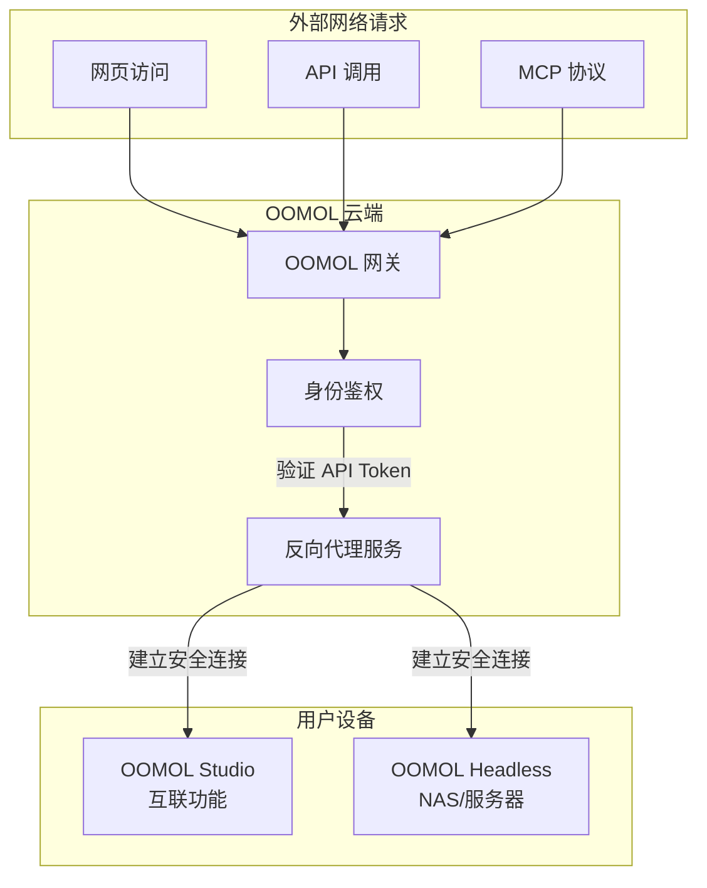

# 互联服务

OOMOL 互联服务是一个创新的解决方案，让您可以通过公网访问本地设备上的 OOMOL 应用，无需复杂的网络配置。

## 架构概览



### 工作原理

1. **外部请求**: 用户通过网页、API 或 MCP 协议发起请求
2. **网关鉴权**: OOMOL 网关验证请求中的 API Token
3. **反向代理**: 验证通过后，网关将请求转发到您的设备
4. **本地处理**: 您的 OOMOL Studio 或 Headless 实例处理请求
5. **返回结果**: 结果通过安全通道返回给请求方

## 用户使用指南

### 通过 OOMOL Applet 使用

访问 [OOMOL Applet](https://connect.oomol.com/applet) 即可开始使用您设备提供的功能。

#### 功能特性

- **网页小应用**: 在浏览器中直接使用各种 OOMOL 应用
- **AI Chat 集成**: 通过 AI 对话界面调用您的设备功能
- **完整生态支持**: OOMOL 社区的所有 Packages 都可以使用

#### 使用步骤

1. 打开 [https://connect.oomol.com/applet](https://connect.oomol.com/applet)
2. 登录您的 OOMOL 账户
3. 选择您想要使用的应用或功能
4. 开始使用，所有计算都在您的设备上完成

### 设备要求

- **OOMOL Studio**: 安装并启动互联功能
- **OOMOL Headless**: 在 NAS 或服务器上运行的 OOMOL Headless 镜像

## 开发者使用指南

### 1. 获取 API Token

访问 [OOMOL Console](https://console.oomol.com/api-key) 获取您的 API Token。

**步骤:**
1. 登录 OOMOL Console
2. 进入 API Key 管理页面
3. 创建新的 API Key
4. 妥善保管您的 Token（不要将其提交到代码仓库）

### 2. 选择 SDK

OOMOL 提供了多种语言的 SDK，方便您集成到项目中：

#### Python SDK
```bash
pip install oomol-connect-sdk
```

**GitHub**: [oomol-connect-sdk-py](https://github.com/oomol-lab/oomol-connect-sdk-py)

#### TypeScript/JavaScript SDK
```bash
npm install @oomol/connect-sdk
```

**GitHub**: [oomol-connect-sdk-ts](https://github.com/oomol-lab/oomol-connect-sdk-ts)

### 3. 快速开始

#### Python 示例

```python
from oomol_connect import Client

# 初始化客户端
client = Client(api_token="your_api_token_here")

# 调用您设备上的 OOMOL 应用
result = client.run_package(
    package_name="your-package-name",
    params={
        "input": "your input data"
    }
)

print(result)
```

#### TypeScript 示例

```typescript
import { Client } from '@oomol/connect-sdk';

// 初始化客户端
const client = new Client({
  apiToken: 'your_api_token_here'
});

// 调用您设备上的 OOMOL 应用
const result = await client.runPackage({
  packageName: 'your-package-name',
  params: {
    input: 'your input data'
  }
});

console.log(result);
```

### 4. 核心优势

#### 🌐 公网访问
OOMOL 互联服务为您的电脑分配一个公网域名，让您的本地设备可以像服务器一样被访问。

#### 🔒 安全可靠
- API Token 鉴权机制
- 加密通信通道
- 完全掌控您的数据

#### ⚡ 高性能
- 智能路由选择
- 低延迟连接
- 自动负载均衡

#### 🔧 易于集成
- 多语言 SDK 支持
- RESTful API 接口
- 详细的文档和示例

## 使用场景

### 个人用户
- 在任何地方访问家中电脑的 AI 功能
- 分享您的 OOMOL 应用给朋友使用
- 移动办公时访问本地资源

### 开发者
- 将本地 OOMOL 应用作为 API 服务
- 构建基于 OOMOL 的 SaaS 应用
- 集成 OOMOL 功能到现有系统

### 企业用户
- 私有化部署，数据不出内网
- 通过公网安全访问内部服务
- 构建混合云解决方案

## 常见问题

### Q: 我的设备需要公网 IP 吗？
A: 不需要。OOMOL 互联服务会为您处理所有网络配置，您只需要能够连接到互联网即可。

### Q: 数据安全吗？
A: 是的。所有通信都经过加密，且您的数据仍然存储在您的设备上，OOMOL 网关只是转发请求。

### Q: 有流量限制吗？
A: 具体限制请参考您的 OOMOL 账户套餐。

## 相关链接

- [OOMOL Applet](https://connect.oomol.com/applet) - 网页端使用入口
- [OOMOL Console](https://console.oomol.com/api-key) - API Token 管理
- [Python SDK](https://github.com/oomol-lab/oomol-connect-sdk-py) - Python 开发者
- [TypeScript SDK](https://github.com/oomol-lab/oomol-connect-sdk-ts) - TypeScript/JavaScript 开发者
- [OOMOL 文档](https://docs.oomol.com) - 完整文档
- [OOMOL 社区](https://community.oomol.com) - 获取帮助和交流

## 技术支持

如果您在使用过程中遇到任何问题，欢迎：
- 查阅我们的[文档中心](https://docs.oomol.com)
- 在 [GitHub](https://github.com/oomol-lab) 提交 Issue
- 加入我们的[社区论坛](https://community.oomol.com)
