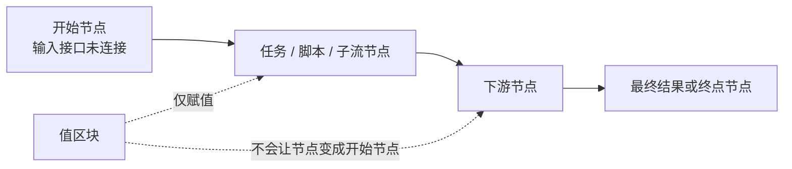

import Image from "@theme/ThemedImage";
import useBaseUrl from "@docusaurus/useBaseUrl";

# 流 (Flow)

流是具体实现的一个业务目的。

在创建项目后，就可以开始实现你的业务目的了。

## 相关概念

流是组织运行时逻辑的容器。在实际使用中，通常会同时接触下面几种概念：

| 概念 | 常见位置 | 表示什么 | 能否被其他流复用 |
| --- | --- | --- | --- |
| 流 | `flows/` | 一个可运行的工作流入口、测试用例或最终应用逻辑 | 不能直接作为另一个流中的节点使用 |
| 任务区块 | `tasks/` | 一个可复用的单一操作 | 可以 |
| 子流区块 | `subflows/` | 封装了多步骤逻辑的可复用工作流 | 可以 |
| Slotflow | 在使用子流时为插槽创建 | 一个用于实现插槽契约的小型工作流 | 服务于它所属的插槽 |

如果你想把一段完整的多步骤能力封装起来并在其他流中复用，应当把它转换成[子流区块](/zh-CN/docs/advanced-guide/advanced-subflow-block)。如果只是一个原子操作，通常任务区块就够了。

## 创建

在你创建好项目后，OOMOL Studio 会为你创建一个默认的流，你也可以通过左侧流面板的创建按钮创建一个新的流。

<Image
  sources={{
    light: useBaseUrl("/img/docs/concepts/create-flow.png"),
    dark: useBaseUrl("/img/docs/concepts/create-flow.png"),
  }}
  width="720"
/>

在选择流之后，可以看到中央的面板进入了流编辑窗口。

## 编辑

流本身是由一个或多个[节点](/zh-CN/docs/concepts/node)组合而成，你可以从右侧区块面版找到各式各样的[区块](/zh-CN/docs/concepts/block)，将他们加入到流后，就会变成流的节点。

流必须要有至少一个节点才有意义，我们这里为流新增两个节点，一个是创建邮件客户端，一个是发送邮件，然后我们将节点连接起来：

<Image
  sources={{
    light: useBaseUrl("/img/docs/concepts/new-flow.png"),
    dark: useBaseUrl("/img/docs/concepts/new-flow.png"),
  }}
  width="720"
/>

这样流就实现了一个发送邮件的业务，业务分为了两个步骤，先创建邮件客户端，然后利用客户端发送邮件。

流中的每个节点都承担了一部分业务职责。有些节点是直接执行任务，有些节点是在调用子流，也有些节点只是辅助节点，比如[值区块](/zh-CN/docs/advanced-guide/reusable-constants)。

## 运行模型

OOMOL Studio 的调度方式是数据流驱动的。也就是说，一个节点什么时候运行，取决于它所需的输入接口数据是否准备好，而不是取决于它在画布上的位置。

## 运行

在 OOMOL Studio 中只有流是可以运行的概念，我们可以运行整个流，也可以运行流中的节点：

<Image
  sources={{
    light: useBaseUrl("/img/docs/concepts/run-flow.png"),
    dark: useBaseUrl("/img/docs/concepts/run-flow.png"),
  }}
  width="720"
/>

流的运行顺序会根据节点的连线为线索，OOMOL Studio 在运行前会进行一次搜索，寻找**输入接口没有连接**的节点作为运行的开始节点。如果有多个开始节点，那么这些开始节点都会同时开始运行。

然后按照输出接口 -> 输入接口的连线顺序运行节点直到结束。

这个模型会带来几个重要结果：

1. 节点在画布上的摆放位置不决定执行顺序，连线才决定。
2. 如果多个开始节点之间互不依赖，它们可以并行运行。
3. 调试时可以只运行选中的节点及其所需的上游节点。
4. 子流节点在调用方流里和普通节点没有本质区别，它内部的细节会被封装起来，除非你进入子流本身继续编辑。

:::info
这里有一个特殊情况的连线，[值区块](/zh-CN/docs/advanced-guide/reusable-constants)的连线只视为赋值，不会影响该节点是否为开始节点判断结果。
:::

## 流的边界

流还是几类配置和运行信息的边界：

- 每次流运行都会产生日志和运行记录。详见[运行与调试](/zh-CN/docs/get-started/run-and-debug)。
- 同一个共享区块可以在一个流里插入多次，每次插入都会变成一个独立的[节点](/zh-CN/docs/concepts/node)。
- 当一个流内部的多步骤逻辑需要在其他流中复用时，可以把它转换成子流区块。
