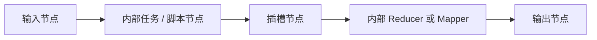

import Image from "@theme/ThemedImage";
import useBaseUrl from "@docusaurus/useBaseUrl";

# 节点 (Node)

节点是组成流的区块。是区块在具体使用环境下的名称。

当你在流编辑器中放入了一个或者多个区块：

<Image
  sources={{
    light: useBaseUrl("/img/docs/concepts/flow-node.png"),
    dark: useBaseUrl("/img/docs/concepts/flow-node.png"),
  }}
  width="720"
/>

这些**在流中**的区块就被称为节点。区块本身可以看做一个封装好的功能，但是如果不把它放在具体的工作环境内使用就没有意义，也无法被运行。

因此处于流中的区块就承担了具体业务的某一个环节的功能，它此时就是可以被运行的节点。

## 常见节点类型

虽然它们在画布上都表现为节点，但它们承担的角色并不相同：

| 节点类型 | 来源 | 作用 |
| --- | --- | --- |
| 任务节点 | 一个共享任务区块 | 执行一个可复用的单一操作 |
| 子流节点 | 一个共享子流区块 | 把多个内部步骤封装成一个节点 |
| 脚本节点 | 直接在流中创建的小脚本区块 | 允许你在当前流里直接写代码并运行 |
| 值节点 | 内置的值区块 | 提供可复用输入值和仅赋值的连线 |
| 插槽节点 | 放在子流内部的插槽 | 声明一个可插拔的行为契约 |
| 输入 / 输出节点 | 子流或 slotflow 内的特殊节点 | 表示该子流对外暴露的边界 |

理解这些区别很重要。例如，一个子流节点背后可能封装了很多内部节点，而脚本节点则会直接把代码暴露在当前流里。

除了小脚本区块节点以外，在流中的节点进行编辑并不会直接影响区块本身的属性和代码，可以认为每个节点都是引用区块的副本，并不会影响原区块的定义。

:::info
只有小脚本区块比较特殊，小脚本区块作为一个可以快速开始编辑代码的手段，是直接在流中进行创建和使用的，因此它同时具有节点和区块的配置属性。

编辑小脚本节点的属性就是在编辑区块本身，每一个小脚本节点都是相互独立的。
:::

## 节点实例与复用

当同一个共享区块被多次插入到流中时，每次插入都会生成一个不同的节点实例：

- 它们可以填写不同的参数值。
- 它们可以连接到不同的上下游节点。
- 它们可以在同一个流中被独立运行和调试。
- 除非它是脚本节点，否则它们仍然引用的是同一个底层共享区块定义。

这也是为什么区块强调“能力复用”，而节点强调“在当前流中的具体使用方式”。

## 子流中的节点

子流会引入几种更特殊的节点角色：

- 输入和输出节点定义了子流从外部接收什么、向外部返回什么。
- 插槽节点允许调用方从子流外部提供一部分行为实现。
- 子流内部的这些节点在调用方流里是不可见的，调用方只会看到一个子流节点。

关于子流中的节点、插槽和 slotflow 的更多说明，请参考[子流区块进阶用法](/zh-CN/docs/advanced-guide/advanced-subflow-block)。
