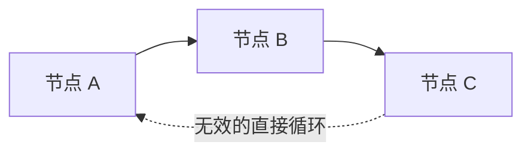

import Image from "@theme/ThemedImage";
import useBaseUrl from "@docusaurus/useBaseUrl";

# 运行与调试

在[环境与依赖](/zh-CN/docs/get-started/env-and-lib)准备完成后，就可以编写流并运行了。

## 运行准备

在运行 Flow 之前，建议先排查下面这些问题：

### 初始化异常

确保初始化脚本运行成功，这代表环境与依赖已经准备好：

<Image
  sources={{
    light: useBaseUrl("/img/docs/get-started/run-and-debug/run-bootstrap.png"),
    dark: useBaseUrl("/img/docs/get-started/run-and-debug/run-bootstrap.png"),
  }}
/>

### 流的异常

确保 Flow 本身没有明显问题，例如参数错误或连线错误。你可以把鼠标移到异常区域查看提示：

<Image
  sources={{
    light: useBaseUrl("/img/docs/get-started/run-and-debug/run-flow-error.png"),
    dark: useBaseUrl("/img/docs/get-started/run-and-debug/run-flow-error.png"),
  }}
/>

最常见的流编写问题通常有下面几类：

- 接口名与上下游声明不完全一致。
- 必填输入仍然没有连接，或者 `nullable` 设置与预期使用方式不一致。
- `task`、`subflow` 或 `slotflow` 的引用写法或命名空间不正确。
- 图中不小心形成了直接循环依赖。

运行前可以快速检查下面四项：

1. 确认连线两端的接口名完全一致。
2. 确认必填输入都已经连接，或者是有意地标记为可空。
3. 确认本地复用单元的引用形式正确，例如 `task: self::{name}`、`subflow: self::{name}`。
4. 确认整张图仍然是一个向前的数据流，而不是回接到上游节点。

如果你确实需要数组上的迭代行为，优先使用内置的 `Map`、`Filter` 这类数组模式，或者设计可复用的子流，而不是在普通流中直接接出一个环。

## 运行

排查完成后，你可以用以下几种方式运行 Flow：

### 全部运行

在中央面板顶部的菜单，点击最左侧的运行按钮，可以运行整个流。

<Image
  sources={{
    light: useBaseUrl("/img/docs/get-started/run-and-debug/run-all.png"),
    dark: useBaseUrl("/img/docs/get-started/run-and-debug/run-all.png"),
  }}
/>

这种方式会清空上一次运行记录，也不会复用缓存，因此等价于一次完整的重新运行。

### 部分运行

在中央面板顶部的菜单，点击最左侧第二个运行按钮，可以运行选中部分的节点。

<Image
  sources={{
    light: useBaseUrl("/img/docs/get-started/run-and-debug/run-selected.png"),
    dark: useBaseUrl("/img/docs/get-started/run-and-debug/run-selected.png"),
  }}
/>

OOMOL Studio 会先解析被选中节点的上游依赖，再从上游开始运行，一直到这些选中节点为止。

### 运行到节点

在节点菜单中点击运行按钮，可以执行到当前节点为止。如果该节点的上游之前已经成功运行过，那么这里会复用[缓存](/zh-CN/docs/advanced-guide/universal-block-settings#缓存机制)，不会再次触发这些上游节点。

<Image
  sources={{
    light: useBaseUrl("/img/docs/get-started/run-and-debug/run-to-node.png"),
    dark: useBaseUrl("/img/docs/get-started/run-and-debug/run-to-node.png"),
  }}
/>

### 不用缓存运行到节点

在节点菜单中点击`不使用缓存运行`，则会重新执行当前节点的全部上游，并一路运行到当前节点。

<Image
  sources={{
    light: useBaseUrl(
      "/img/docs/get-started/run-and-debug/run-to-node-no-cache.png"
    ),
    dark: useBaseUrl(
      "/img/docs/get-started/run-and-debug/run-to-node-no-cache.png"
    ),
  }}
/>

## 日志

无论使用哪种方式运行 Flow，底部日志面板都会显示本次运行日志。每次新运行都会覆盖当前展示的上一次运行结果。

日志会记录每个节点运行时的输入输出，以及代码打印到标准输出的内容。

<Image
  sources={{
    light: useBaseUrl("/img/docs/get-started/run-and-debug/run-log.png"),
    dark: useBaseUrl("/img/docs/get-started/run-and-debug/run-log.png"),
  }}
/>

### 功能

#### 筛选

参与本次运行的所有节点都会显示在左侧栏中。点击某个节点后，可以筛选出该节点对应的日志。

<Image
  sources={{
    light: useBaseUrl("/img/docs/get-started/run-and-debug/run-log-filter.png"),
    dark: useBaseUrl("/img/docs/get-started/run-and-debug/run-log-filter.png"),
  }}
/>

#### 搜索

搜索功能可以按关键词检索日志内容，并且区分大小写。

<Image
  sources={{
    light: useBaseUrl("/img/docs/get-started/run-and-debug/run-log-search.png"),
    dark: useBaseUrl("/img/docs/get-started/run-and-debug/run-log-search.png"),
  }}
/>

#### 未捕获日志

将搜索栏右侧菜单切换为 `Studio` 后，日志栏会显示 OOMOL Studio 内部未被正常捕获的日志。

<Image
  sources={{
    light: useBaseUrl("/img/docs/get-started/run-and-debug/run-log-studio.png"),
    dark: useBaseUrl("/img/docs/get-started/run-and-debug/run-log-studio.png"),
  }}
/>

一般来说，这类日志只会出现在一些边缘场景里，也就是内部异常没有被正常归档到工作流日志中的情况。

#### 导出

可以将当次运行的全量日志导出到指定的文件夹内。

导出的日志还会包含内部调度器和执行器的日志，通常用于定位应用层异常。

<Image
  sources={{
    light: useBaseUrl("/img/docs/get-started/run-and-debug/run-log-export.png"),
    dark: useBaseUrl("/img/docs/get-started/run-and-debug/run-log-export.png"),
  }}
/>

:::info
如果日志内容过长，OOMOL Studio 可能不会直接把它们完整渲染出来，以避免界面异常。你仍然可以通过导出日志查看完整内容。
:::

如果你在运行流之后发现无法处理的异常情况，可以尝试将运行日志导出后发送到 OOMOL Studio 的官方支持 `support@oomol.com` 获取支持。
