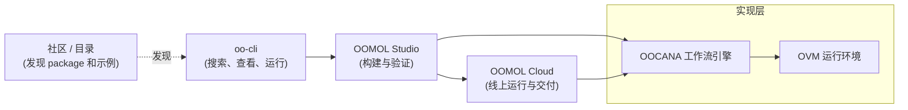

import desktop from "@site/static/img/docs/cn/desktop.png";
import ResponsiveVideo from "@site/src/components/mdx/ResponsiveVideo";

  先从 oo-cli 开始。现成工具不够时进入 Studio。需要持续运行和交付时再交给
  Cloud。

这份文档遵循主官网现在的产品路径。如果你只是想先把已发布工具跑起来，就从
`oo-cli` 开始；如果你需要自己编写、扩展和验证工具，就进入 OOMOL Studio；
如果这份实现已经验证完成并需要托管运行、统一配置或对外交付，再继续使用
OOMOL Cloud。

<ResponsiveVideo
  src="https://cloud-storage.oomol.com/users/019343aa-ff25-727c-a449-9017313539b0/chat-uploads/2026-03-23/4gxes_hu5_ua-OOMOL_Studio.webm"
  type="video/webm"
  controls
  autoPlay
  muted
  loop
  playsInline
  preload="metadata"
  poster={desktop}
/>

## 主路径

### 1. oo-cli

当你希望 Agent 先搜索、查看并直接运行现成工具时，从 `oo-cli` 开始。

- 适合 Codex、Claude Code、终端工作流和其他 Agent
- 包含搜索、查看、connector 调用、Cloud Task、skills、文件和账号能力
- 当问题已经有已发布工具可用时，这是最短路径

### 2. OOMOL Studio

当现成工具不够，需要自己做、自己改、自己验证时，再进入 OOMOL Studio。

- 在真实 coding 环境里生成和编辑 function tool
- 用同一份实现先在本地验证，再决定是否继续交付
- 把连接、编排、依赖和自定义逻辑放在一条连续路径里完成

### 3. OOMOL Cloud

当实现已经验证完成，并且需要托管运行、持续交付或统一管理时，再使用 OOMOL
Cloud。

- 把运行配置、Secrets、权限和发布关系放进同一个后台
- 不用围绕同一份实现再补一层新的交付系统
- 继续把同一套能力通过 API、MCP、自动化和 `oo-cli` 交付出去

## 文档如何使用

- [oo-cli](/zh-CN/docs/oo-cli)：如果你想先让 Agent 和终端工作流直接使用已发布工具，就从这里开始
- [OOMOL Studio](/zh-CN/docs/concepts/project)：如果你需要自己构建、扩展和验证工具，就看这里
- [Cloud Function](/zh-CN/docs/cloud-services/cloud-function)：如果工具已经验证完成，并需要托管运行和线上交付，就看这里
- [Support](/zh-CN/docs/community)：如果你需要发布、社区和相关运维信息，就看这里

## 产品层次

底层开源层仍然重要，但它们不再是大多数新用户的第一站：

- `OOCANA` 是执行背后的工作流引擎
- `OVM` 是 OOMOL Studio 和相关能力依赖的运行环境

如果你是第一次接触 OOMOL，先按上面的用户路径理解产品，再在需要实现细节时
往下看底层部分。
