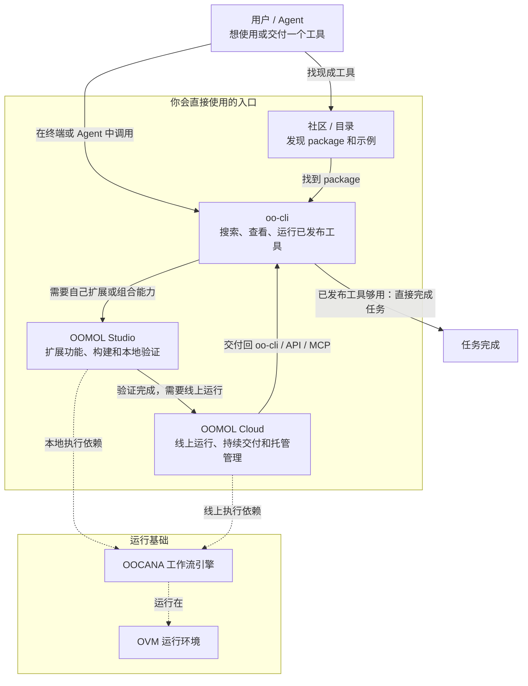

<section className="docs-overview-intro">
  <h1>面向 AI 辅助阅读的文档</h1>
  

    OOMOL
    文档适合交给 AI 阅读、检索和总结。建议先把完整文档站提供给 AI，让它理解产品结构、命令和工作流，再直接围绕具体问题问答。
  

  

    如果问题发生在 OOMOL Studio 内，优先使用 Studio 右侧的 Oopilot。
  

</section>

## 主路径

### 1. oo-cli

当你希望 Agent 先搜索、查看并直接运行已发布工具时，从 `oo-cli` 开始。

- 适合 Codex、Claude Code、终端工作流和其他 Agent
- 包含官方安装与更新、账号认证、搜索、查看、connector 调用、Cloud Task、skills、文件、日志和 shell 补全
- 当问题已经有已发布 package、connector 或 skill 可用时，这是最短路径

### 2. OOMOL Studio

当已发布工具不够，需要自己做、自己改、自己验证时，再进入 OOMOL Studio。

- 在真实 coding 环境里生成和编辑 function tool
- 用同一份实现先在本地验证，再决定是否继续交付
- 把连接、编排、依赖和自定义逻辑放在一条连续路径里完成

### 3. OOMOL Cloud

当实现已经验证完成，并且需要托管运行、持续交付或统一管理时，再使用 OOMOL
Cloud。

- 把运行配置、Secrets、权限和发布关系放进同一个后台
- 不用围绕同一份实现再补一层新的交付系统
- 继续把同一套能力通过 API、MCP、自动化和 `oo-cli` 交付出去

## 文档如何使用

- [oo-cli](/zh-CN/docs/oo-cli)：如果你想先让 Agent 和终端工作流直接使用已发布工具，就从这里开始
- [OOMOL Studio](/zh-CN/docs/studio/overview)：如果你需要自己构建、扩展和验证工具，就看这里
- [Cloud Function](/zh-CN/docs/cloud-services/cloud-function)：如果工具已经验证完成，并需要托管运行和线上交付，就看这里
- [Support](/zh-CN/docs/community)：如果你需要发布、社区和相关运维信息，就看这里

## 用户路径与产品层次

先看上半部分的用户路径：

- 想找现成能力时，先去社区或目录发现 package，再用 `oo-cli` 搜索、查看和运行。
- 当现成能力不够，需要扩展功能或组合自己的流程时，进入 OOMOL Studio。
- 当工具已经验证完成，并且需要线上运行、持续交付或统一管理时，使用 OOMOL Cloud。

下半部分是运行基础，不是大多数用户的第一入口：

- `OOCANA` 是执行背后的工作流引擎。
- `OVM` 是 OOMOL Studio 和相关能力依赖的运行环境。
