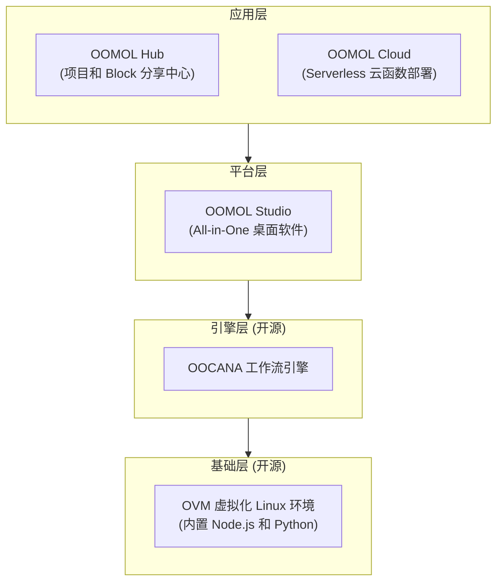

import desktop from "@site/static/img/docs/cn/desktop.png";
import hub from "@site/static/img/docs/cn/hub.png";
import hub_detail from "@site/static/img/docs/cn/hub_detail.png";
import desktop_detail from "@site/static/img/docs/cn/desktop_detail.png";

<h1 className="docs-overview-sr-only">概述</h1>

  

    
先问 Agent，再查细节

    

      使用 OOMOL Studio，不用仔细阅读每一个章节。
    

    

      直接在 Studio 里面问 Agent 怎么做；如果你已经问清楚、也想清楚了，
      就直接让 Agent 执行。文档更适合在你需要细节、参数和原理的时候再回来查。
    

    

      

        不知道怎么做
        <strong>直接问 Agent</strong>
        

          让它告诉你步骤、需要哪些 Block，以及从哪里开始。
        

      

      

        已经知道要做什么
        <strong>直接让 Agent 执行</strong>
        

          把目标说清楚，让它直接搭工作流、改参数、补代码。
        

      

    

  

  

    

      演示视频
      <small>在第一屏先看一遍，再决定是否继续读文档</small>
    

    <video
      className="docs-overview-video"
      controls
      autoPlay
      muted
      loop
      playsInline
      preload="metadata"
      poster={desktop}
    >
      <source
        src="https://cloud-storage.oomol.com/users/019343aa-ff25-727c-a449-9017313539b0/chat-uploads/2026-03-23/4gxes_hu5_ua-OOMOL_Studio.webm"
        type="video/webm"
      />
    </video>
  

## 核心特点

OOMOL 是一个 AI 驱动的工作流平台，面向数据分析、自动化以及智能体构建。相比同类产品，我们更强调开源生态和开发者可编程性。

### 开源

我们的商业模式很直接：底层执行引擎完全开源，上层应用提供产品化体验和托管服务。

- 底层执行引擎开源，便于开发者理解运行机制，并在需要时进行定制
- 计划支持导出容器镜像，进一步简化跨平台部署

### 可编程

我们的核心能力之一是 Scriptlet Block，支持开发者使用 Python 和 Node.js 编写自定义业务逻辑。

- 传统工作流产品通常要求用户围绕预设模块拼接，业务实现容易受限
- OOMOL 可以把工作流和开源生态直接连起来，让你在工作流中直接使用常见开源库

### AI 原生

- 集成 AI 辅助编程能力，降低上手门槛
- 支持基于大模型 function calling 的 Agent 式编排与生成
- 内置多种 AI 模型，开发者无需复杂配置即可直接使用

## 产品架构

### OOMOL STUDIO

> OOMOL 桌面应用

1. 方便的拖放式工作流。
2. 专业的代码编辑器。
3. 精美的数据可视化展示。

### OOMOL Hub

> OOMOL 分享中心

1. 分享你的创意。
2. 与社区中的朋友协作项目。
3. 从社区中寻找灵感。

### OOMOL Cloud

> OOMOL 云函数服务

1. 基于 Web 访问，无需本地安装。
2. 在本地算力不够时，可以按需使用云端计算资源。
3. 支持通过 API 等形式对外提供能力。

### OVM

> OOMOL 虚拟机

1. 提供隔离的容器环境，确保安全性与可移植性
2. 内置多语言开发环境，开箱即用

**开源仓库**

- https://github.com/oomol-lab/ovm
- https://github.com/oomol-lab/ovm-core
- https://github.com/oomol-lab/ovm-win
- https://github.com/oomol-lab/ovm-js

### OOCANA

> OOMOL 工作流引擎

1. 负责块调度。
2. 吞吐量管理。

**开源仓库**

- https://github.com/oomol/oocana-node
- https://github.com/oomol/oocana-python
- https://github.com/oomol/oocana-rust
