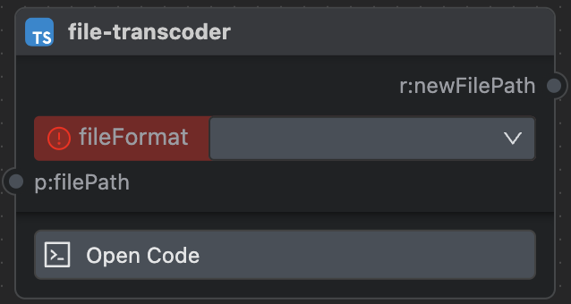

# Shark in Flowhub

## Properties

| property    | type                                                    | description    |
| ----------- | ------------------------------------------------------- | -------------- |
| props       | \{[handleKey]: [Handle](block#handle-type)} \| undefined | block input    |
| results     | \{[handleKey]: [Handle](block#handle-type)} \| undefined | block output   |
| options     | \{[handleKey]: [Handle](block#handle-type)} \| undefined | block options  |
| title       | string \| undefined                                     | block title    |
| description | string \| undefined                                     | description    |
| icon        | string \| undefined                                     | icon url       |
| entry       | [Entry](block#entry-type)                               | params for start up a Block |

**yaml sample:**

```
props:
  filePath:
    optional: true
    schema:
      type: string
      minLength: 4
    description: "input file path"
results:
  newFilePath:
    optional: false
    schema:
      type: string
    description: "output file path"
options:
  fileFormat:
    schema:
      type: string
      "ui:widget": select
      "ui:options":
        metaOptions: 
          - label: csv
            value: csv
          - label: xls
            value: xls
    description: "file format"
title: file transcoder
description: transcode file to another format
icon: ./file-transcoder
entry:
  bin: vocana-executor-node
  envs: {}
  args:
    - ./index.ts
```

above config in graph should be:


## Handle

Handle is a connection point in Graph which means data. Props, Results, Options can be Handles.

### Handle type

Handle type is an object which key is Handle id and value is Handle properties.

| property     | value                    | description                     |
| ------------ | ------------------------ | ------------------------------- |
| optional     | boolean \| undefined     | is this handle data optional    |
| schema       | any \| undefined         | handle data schema, use [JsonSchema](https://json-schema.org/understanding-json-schema) standard |
| description  | description \| undefined | handle description              |

In order to allow users to quickly write the UI of the block, we map the schema field of Options to the built-in widget.
Check [Builtin Widget](/docs/reference/builtin-widget) for more details.

## Entry

Entry is a collection of params for start up a Block.

### Entry type

<div style={{color: "red"}}>coming soon</div>
